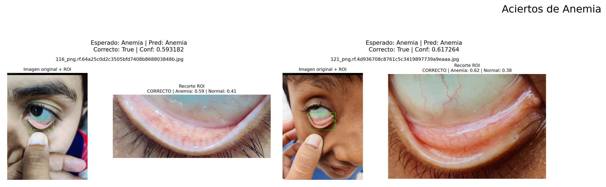
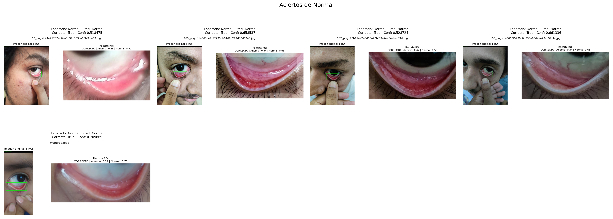
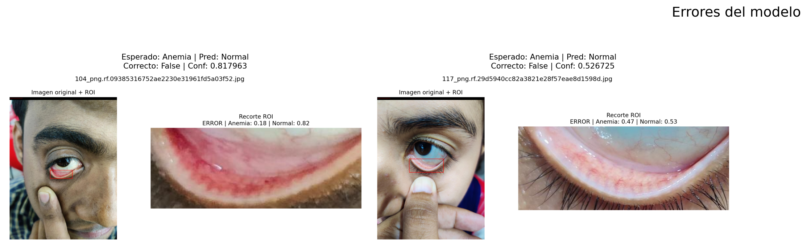

# Sistema de apoyo al tamizaje de Anemia mediante Análisis de Conjuntiva Palpebral con YOLOv8n y EfficientNet-B0

**Proyecto de tesis:** Sistema de apoyo al tamizaje de anemia por conjuntiva palpebral por medio de imágenes de conjuntiva palpebral inferior y clasificación binaria `Anemia` / `Normal`  
**Autores:** John Rivera, Manuel Cochachin  
**Línea de investigación:** Visión por computadora aplicada al procesamiento de imágenes biomédicas  
**Dataset base:** Anemia Detection v6 — Roboflow Universe  
**Notebook principal:** `cp_v2_semana5_pipeline_FINAL.ipynb`  
**Modelos utilizados:** YOLOv8n + EfficientNet-B0  
**Lenguaje:** Python 3.10  
**Frameworks principales:** PyTorch, Torchvision, Ultralytics YOLO, Scikit-learn  

---

## Tabla de contenido

1. [Resumen del proyecto](#1-resumen-del-proyecto)
2. [Objetivos](#2-objetivos)
3. [Integrantes y responsabilidades](#3-integrantes-y-responsabilidades)
4. [Tareas resueltas](#4-tareas-resueltas)
5. [Fuente de datos](#5-fuente-de-datos)
6. [Estructura del dataset procesado](#6-estructura-del-dataset-procesado)
7. [Arquitectura general del pipeline](#7-arquitectura-general-del-pipeline)
8. [Notebook principal](#8-notebook-principal)
9. [Estructura recomendada del repositorio](#9-estructura-recomendada-del-repositorio)
10. [Entorno de ejecución](#10-entorno-de-ejecución)
11. [Instalación](#11-instalación)
12. [Ejecución](#12-ejecución)
13. [Configuración central](#13-configuración-central)
14. [Preprocesamiento y transformación de imágenes](#14-preprocesamiento-y-transformación-de-imágenes)
15. [Modelo detector de región de interés](#15-modelo-detector-de-región-de-interés)
16. [Modelo clasificador](#16-modelo-clasificador)
17. [Calibración y umbral de decisión](#17-calibración-y-umbral-de-decisión)
18. [Evaluación comparativa](#18-evaluación-comparativa)
19. [Gráficas y evidencia visual](#19-gráficas-y-evidencia-visual)
20. [Evaluación visual con carpeta testImage](#20-evaluación-visual-con-carpeta-testimage)
21. [Artefactos generados](#21-artefactos-generados)
22. [Reproducibilidad](#22-reproducibilidad)
23. [Inferencia individual](#23-inferencia-individual)
24. [Archivos recomendados para GitHub](#24-archivos-recomendados-para-github)
25. [Resultado consolidado](#25-resultado-consolidado)
26. [Referencia rápida](#26-referencia-rápida)

---

## 1. Resumen del proyecto

Este repositorio contiene la implementación de un pipeline de visión por computadora para procesar imágenes de conjuntiva palpebral inferior, localizar la región de interés y clasificar la muestra en dos clases: `Anemia` y `Normal`.

La solución integra dos componentes principales:

| Componente | Modelo | Función dentro del sistema |
|---|---|---|
| Detector de región de interés | YOLOv8n | Localiza la zona de conjuntiva mediante bounding box. |
| Clasificador visual | EfficientNet-B0 | Clasifica la imagen completa o el recorte ROI en `Anemia` / `Normal`. |

El pipeline implementa carga de datos, validación de estructura, auditoría de separación de subconjuntos, entrenamiento/carga de modelos, calibración de probabilidades, comparación de variantes, evaluación sobre conjunto `test` y generación de evidencia visual para revisión académica.

---

## 2. Objetivos

### Objetivo general

Desarrollar un sistema basado en visión por computadora para clasificar imágenes de conjuntiva palpebral inferior en las clases `Anemia` y `Normal`, integrando detección automática de región de interés mediante YOLOv8n y clasificación visual mediante EfficientNet-B0.

### Objetivos específicos

1. Organizar el dataset en subconjuntos `train`, `val` y `test` bajo una estructura compatible con YOLOv8 y PyTorch.
2. Validar la estructura del dataset, la correspondencia entre imágenes y etiquetas, y la disponibilidad del entorno de ejecución.
3. Implementar una auditoría de separación de datos mediante identificador base de imagen.
4. Entrenar o cargar un detector YOLOv8n para localizar la región de conjuntiva palpebral inferior.
5. Implementar un clasificador EfficientNet-B0 para clasificación binaria de imágenes completas y recortes ROI.
6. Comparar tres variantes de procesamiento: imagen completa, ROI desde etiqueta y ROI detectada por YOLO.
7. Calibrar las probabilidades del clasificador y seleccionar el umbral de decisión usando validación.
8. Consolidar métricas, matrices de confusión, predicciones de muestra, reportes y artefactos visuales.

---

## 3. Integrantes y responsabilidades

| Integrante | Rol principal en el proyecto |
|---|---|
| John Rivera | Implementación del pipeline, estructuración del dataset, entrenamiento/evaluación de modelos, consolidación de resultados y documentación técnica. |
| Manuel Cochachin | Apoyo en configuración del entorno, validación de ejecución, revisión de métricas, organización del avance y documentación académica. |

---

## 4. Tareas resueltas

Las tareas se reorganizan según el estado actual del notebook `cp_v2_semana5_pipeline_FINAL.ipynb`, evitando mezclar métricas de versiones anteriores con los resultados del pipeline vigente.

| ID | Tarea desarrollada | Responsable | Estado | Evidencia en el repositorio |
|---:|---|---|---|---|
| 1 | Definición del pipeline de ingesta y estructura de datos | John Rivera | Completado | `data_clean.yaml`, `dataset_clean/` |
| 2 | Validación del entorno de ejecución y disponibilidad GPU/CUDA | Manuel Cochachin | Completado | Bloques de validación del notebook |
| 3 | Instalación y uso de dependencias principales | Manuel Cochachin | Completado | `requirements.txt`, entorno `.venv` |
| 4 | Preparación de dataset con formato YOLOv8 | John Rivera | Completado | `images/`, `labels/`, anotaciones `.txt` |
| 5 | Auditoría de separación entre `train`, `val` y `test` | John Rivera | Completado | `split_leakage_audit.json` |
| 6 | Implementación de transformaciones y normalización de imágenes | Manuel Cochachin | Completado | Transformaciones PyTorch del notebook |
| 7 | Entrenamiento/carga del detector YOLOv8n para ROI | John Rivera | Completado | `runs/detect/week5_yolo_*/weights/best.pt` |
| 8 | Implementación del clasificador EfficientNet-B0 | John Rivera | Completado | Clase `AnemiaClassifier` |
| 9 | Evaluación Baseline con imagen completa | John Rivera | Completado | `artifacts/week5_pipeline/baseline_full/` |
| 10 | Evaluación Var1 con ROI desde etiqueta | John Rivera | Completado | `artifacts/week5_pipeline/roi_gt/` |
| 11 | Evaluación Var2 con ROI detectada por YOLO | Manuel Cochachin | Completado | `artifacts/week5_pipeline/yolo_e2e/` |
| 12 | Calibración de probabilidades y selección de umbral | Manuel Cochachin | Completado | `calibration.json`, `threshold.json` |
| 13 | Consolidación de métricas, matrices y reportes | John Rivera | Completado | `comparison_results.csv`, `formal_test_summary.md` |
| 14 | Generación de evidencia visual para sustentación | John Rivera | Completado | `media/`, `manual_testImage_predictions/` |
| 15 | Documentación final del repositorio para GitHub | John Rivera, Manuel Cochachin | Completado | `README.md` |

---

## 5. Fuente de datos

El proyecto utiliza como fuente base el conjunto de datos público:

| Campo | Detalle |
|---|---|
| Origen | Roboflow Universe |
| Nombre del dataset | Anemia Detection v6 |
| Fecha de exportación documentada | 3 de enero de 2026 |
| Licencia reportada | CC BY 4.0 |
| URL | `https://universe.roboflow.com/diabetic-prediction-by-tongue-image-classification/anemia-detection-u0dhr-rzmdb` |
| Formato de anotación | YOLOv8 |
| Clases | `Anemia`, `Normal` |

Formato de etiqueta YOLO utilizado:

```text
class_id x_center y_center width height
```

Clases del proyecto:

| ID | Clase |
|---:|---|
| 0 | Anemia |
| 1 | Normal |

---

## 6. Estructura del dataset procesado

El notebook trabaja con el archivo:

```text
data_clean.yaml
```

Este archivo referencia la versión procesada del dataset:

```text
dataset_clean/train
dataset_clean/val
dataset_clean/test
```

Distribución registrada en el pipeline vigente:

| Split | Imágenes | Uso dentro del pipeline |
|---|---:|---|
| Train | 2053 | Entrenamiento de YOLO y clasificadores. |
| Validation | 251 | Validación, calibración y selección de umbral. |
| Test | 285 | Evaluación final de desempeño. |
| Total | 2589 | Total de imágenes procesadas. |

Distribución del conjunto de entrenamiento para clasificación:

| Clase | Imágenes en train |
|---|---:|
| Anemia | 1029 |
| Normal | 1024 |

### Limpieza y validaciones aplicadas

| Proceso | Descripción |
|---|---|
| Validación de estructura | Verificación de carpetas `images/` y `labels/` por split. |
| Correspondencia imagen/label | Comprobación de pares imagen-anotación en formato YOLO. |
| Lectura de clases | Extracción de `class_id` desde archivos `.txt`. |
| Conversión de imagen | Lectura en RGB para procesamiento con PyTorch. |
| Redimensionamiento | Entrada uniforme de 224×224 para EfficientNet-B0. |
| Auditoría por imagen base | Revisión de coincidencias entre splits considerando nombres con patrón `nombre.rf.hash.jpg`. |

Resultado de auditoría de separación:

| Comparación | Coincidencias detectadas |
|---|---:|
| Train vs Validation | 0 |
| Train vs Test | 0 |
| Validation vs Test | 0 |

Archivo generado:

```text
artifacts/week5_pipeline/split_leakage_audit.json
```

---

## 7. Arquitectura general del pipeline

```text
Dataset limpio
    ↓
Validación de entorno
    ↓
Carga de train / val / test
    ↓
Auditoría de separación de datos
    ↓
Entrenamiento o carga de YOLOv8n
    ↓
Construcción de datasets PyTorch
    ↓
Entrenamiento de EfficientNet-B0
    ↓
Calibración con validación
    ↓
Evaluación sobre test
    ↓
Comparación de variantes
    ↓
Generación de reportes y evidencia visual
```

Flujo integral de inferencia:

```text
Imagen de entrada
    ↓
YOLOv8n
    ↓
Bounding box de conjuntiva
    ↓
Recorte ROI
    ↓
Normalización ImageNet
    ↓
EfficientNet-B0
    ↓
Calibración de probabilidad
    ↓
Aplicación de umbral
    ↓
Predicción final: Anemia / Normal
```

Variantes evaluadas:

| Variante | Entrada al clasificador | Descripción |
|---|---|---|
| Baseline | Imagen completa | EfficientNet-B0 recibe la imagen original redimensionada. |
| Var1 | ROI desde etiqueta | EfficientNet-B0 recibe el recorte generado desde la anotación YOLO real. |
| Var2 | ROI detectada por YOLO | YOLOv8n detecta la ROI y EfficientNet-B0 realiza la clasificación final. |

---

## 8. Notebook principal

Archivo principal:

```text
cp_v2_semana5_pipeline_FINAL.ipynb
```

Bloques implementados:

| Bloque | Componente | Función principal |
|---:|---|---|
| 1 | Configuración central | Define rutas, parámetros, pesos, tamaño de imagen, umbrales y opciones de ejecución. |
| 2 | Utilidades generales | Control de semilla, rutas, guardado de JSON y validación de entorno. |
| 3 | Lectura de `data_clean.yaml` | Carga rutas de entrenamiento, validación, prueba y nombres de clases. |
| 4 | Auditoría de datos | Verifica separación entre `train`, `val` y `test` por identificador base. |
| 5 | Dataset PyTorch | Construye datasets para imagen completa y ROI desde anotaciones YOLO. |
| 6 | Transformaciones | Aplica aumentación controlada en entrenamiento y normalización en validación/prueba. |
| 7 | Modelo | Define `AnemiaClassifier` con EfficientNet-B0. |
| 8 | Entrenamiento | Entrena, valida, guarda checkpoints y aplica early stopping. |
| 9 | Evaluación | Calcula métricas, matriz de confusión y tiempos de inferencia. |
| 10 | YOLO | Entrena o carga el detector de región de interés. |
| 11 | End-to-end | Evalúa imagen → YOLO ROI → EfficientNet → predicción final. |
| 12 | Inferencia individual | Clasifica una imagen nueva y genera salida visual anotada. |
| 13 | Artefactos | Genera tablas, reportes, figuras y evidencia visual. |
| 14 | Prueba `testImage` | Ejecuta una validación visual adicional con imágenes organizadas por carpeta. |

---

## 9. Estructura recomendada del repositorio

```text
Proyecto_Deteccion_Conjuntiva_v1-main/
│
├── cp_v2_semana5_pipeline_FINAL.ipynb
├── README.md
├── requirements.txt
├── data_clean.yaml
│
├── dataset_clean/
│   ├── train/
│   │   ├── images/
│   │   └── labels/
│   ├── val/
│   │   ├── images/
│   │   └── labels/
│   └── test/
│       ├── images/
│       └── labels/
│
├── testImage/
│   ├── Anemia/
│   └── Normal/
│
├── runs/
│   └── detect/
│       └── week5_yolo_*/
│           └── weights/
│               ├── best.pt
│               └── last.pt
│
├── artifacts/
│   └── week5_pipeline/
│       ├── baseline_full/
│       ├── roi_gt/
│       ├── yolo_e2e/
│       ├── evidence_pack/
│       └── manual_testImage_predictions/
│
└── media/
    ├── image1.png
    ├── image2.png
    ├── image3.png
    ├── image4.png
    ├── image5.png
    ├── image6.png
    ├── image7.png
    ├── image8.png
    ├── image9.png
    └── image10.png
```

---

## 10. Entorno de ejecución

Entorno registrado por el notebook:

| Componente | Valor |
|---|---|
| Sistema operativo | Windows |
| Python | 3.10.0 |
| Entorno virtual | `.venv` |
| PyTorch | 2.11.0+cu126 |
| CUDA | 12.6 |
| GPU | NVIDIA GeForce GTX 1660 SUPER |
| VRAM | 6.44 GB |
| Ultralytics | 8.4.48 |

---

## 11. Instalación

Crear entorno virtual:

```bash
python -m venv .venv
```

Activar entorno en Windows:

```bash
.venv\Scripts\activate
```

Instalar dependencias:

```bash
python -m pip install --upgrade pip
python -m pip install -r requirements.txt
```

Registrar kernel para Jupyter o VS Code:

```bash
python -m ipykernel install --user --name anemia_env --display-name "Python 3.10 - Anemia Pipeline (.venv)"
```

---

## 12. Ejecución

Abrir el notebook:

```text
cp_v2_semana5_pipeline_FINAL.ipynb
```

Seleccionar el kernel:

```text
Python 3.10 - Anemia Pipeline (.venv)
```

Ejecutar las celdas en orden. El punto de entrada del pipeline principal es:

```python
if __name__ == "__main__":
    warnings.filterwarnings("ignore", category=UserWarning)
    results = main(CFG)
```

Carpeta principal de salida:

```text
artifacts/week5_pipeline/
```

---

## 13. Configuración central

La configuración principal se define en:

```python
PipelineConfig
```

Parámetros registrados:

| Parámetro | Valor |
|---|---:|
| `seed` | 42 |
| `image_size` | 224 |
| `roi_margin` | 0.08 |
| `yolo_imgsz` | 416 |
| `yolo_batch` | 2 |
| `yolo_conf_threshold` | 0.15 |
| `batch_size` | 16 |
| `learning_rate` | 1e-3 |
| `weight_decay` | 1e-4 |
| `threshold_min` | 0.20 |
| `threshold_max` | 0.80 |
| `threshold_step` | 0.01 |

Archivo de configuración generado:

```text
artifacts/week5_pipeline/config_used.json
```

---

## 14. Preprocesamiento y transformación de imágenes

### Transformaciones de entrenamiento

```text
Resize(224 x 224)
RandomHorizontalFlip(p=0.5)
RandomRotation(8°)
ColorJitter(brightness=0.10, contrast=0.10, saturation=0.02, hue=0.0)
RandomAffine(translate=0.05, scale=0.95–1.05)
ToTensor()
Normalize(ImageNet mean/std)
```

### Transformaciones de validación y prueba

```text
Resize(224 x 224)
ToTensor()
Normalize(ImageNet mean/std)
```

Valores de normalización:

```text
mean = [0.485, 0.456, 0.406]
std  = [0.229, 0.224, 0.225]
```

---

## 15. Modelo detector de región de interés

Detector utilizado:

```python
YOLO("yolov8n.pt")
```

Salida esperada:

```text
runs/detect/week5_yolo_*/weights/best.pt
```

Métricas registradas en validación:

| Clase | Images | Instances | Box Precision | Recall | mAP50 | mAP50-95 |
|---|---:|---:|---:|---:|---:|---:|
| all | 251 | 251 | 0.337 | 0.590 | 0.335 | 0.177 |
| Anemia | 120 | 120 | 0.207 | 0.617 | 0.262 | 0.128 |
| Normal | 131 | 131 | 0.467 | 0.563 | 0.407 | 0.226 |

Velocidad registrada por imagen:

| Etapa | Tiempo |
|---|---:|
| Preprocess | 0.3 ms |
| Inference | 3.3 ms |
| Postprocess | 1.4 ms |

---

## 16. Modelo clasificador

Clasificador implementado:

```python
AnemiaClassifier
```

Arquitectura base:

```text
EfficientNet-B0
```

Características:

| Elemento | Configuración |
|---|---|
| Backbone | EfficientNet-B0 |
| Pesos base | ImageNet |
| Salida | 2 clases |
| Loss | CrossEntropyLoss |
| Optimizador | AdamW |
| Scheduler | ReduceLROnPlateau |
| Checkpoint | Mejor modelo por validación |
| Calibración | Temperature Scaling |
| Umbral | Seleccionado con validación |

Parámetros registrados:

| Modelo | Parámetros totales | Parámetros entrenables |
|---|---:|---:|
| EfficientNet-B0 | 4,010,110 | 2,562 |

---

## 17. Calibración y umbral de decisión

Las probabilidades del clasificador se calibran con Temperature Scaling usando el conjunto de validación.

| Variante | Temperatura | Umbral para `Anemia` |
|---|---:|---:|
| Baseline | 1.1206 | 0.48 |
| Var1 | 1.1229 | 0.61 |
| Var2 | 1.1499 | 0.53 |

Regla de decisión:

```text
Si P(Anemia) >= umbral definido → Anemia
Si P(Anemia) <  umbral definido → Normal
```

---

## 18. Evaluación comparativa

Evaluación realizada sobre 285 imágenes del conjunto `test`.

| Variante | Entrada | Accuracy | F1 macro | Precision macro | Recall macro | Recall Anemia | Recall Normal | FN Anemia | FP Anemia | Detection rate | ms/img |
|---|---|---:|---:|---:|---:|---:|---:|---:|---:|---:|---:|
| Baseline | Imagen completa | 0.6982 | 0.6978 | 0.7002 | 0.6987 | 0.7447 | 0.6528 | 36 | 50 | 1.0000 | 20.13 |
| Var1 | ROI con bbox real/label | 0.7333 | 0.7301 | 0.7426 | 0.7323 | 0.6312 | 0.8333 | 52 | 24 | 1.0000 | 14.99 |
| Var2 | YOLO ROI + clasificador ROI | 0.6807 | 0.6776 | 0.6899 | 0.6818 | 0.7872 | 0.5764 | 30 | 61 | 0.9825 | 43.03 |

Resultado consolidado por criterio:

| Criterio | Variante | Resultado |
|---|---|---:|
| Mayor accuracy | Var1 | 0.7333 |
| Mayor F1 macro | Var1 | 0.7301 |
| Mayor recall de Anemia | Var2 | 0.7872 |
| Menor cantidad de FN Anemia | Var2 | 30 |
| Menor tiempo por imagen | Var1 | 14.99 ms/img |
| Flujo integral automatizado | Var2 | YOLO ROI + EfficientNet |

Matrices de confusión:

```text
Baseline — Imagen completa
[[105, 36],
 [ 50, 94]]

Var1 — ROI desde etiqueta real
[[ 89, 52],
 [ 24,120]]

Var2 — YOLO ROI + EfficientNet
[[111, 30],
 [ 61, 83]]
```

---

## 19. Gráficas y evidencia visual

Las gráficas del pipeline se incluyen en la carpeta `media/` para visualización directa en GitHub.


**Figura 1. Comparación de métricas principales sobre conjunto test.**


**Figura 2. Matrices de confusión de Baseline, Var1 y Var2.**


**Figura 3. Métricas de validación del detector YOLOv8n.**


**Figura 4. Matriz de confusión manual sobre carpeta `testImage`.**


**Figura 5. Resumen de ejecución manual.**


**Figura 6. Ejemplo de salida end-to-end: YOLO ROI + EfficientNet.**


**Figura 7. Muestra visual mixta de predicciones.**



**Figura 8. Aciertos correspondientes a la clase `Anemia`.**



**Figura 9. Aciertos correspondientes a la clase `Normal`.**



**Figura 10. Errores identificados durante la evaluación visual manual.**

---

## 20. Evaluación visual con carpeta testImage

El notebook incorpora una evaluación adicional usando imágenes ubicadas en:

```text
testImage/
```

La etiqueta esperada se obtiene en este orden:

1. Archivo YOLO `.txt` asociado a la imagen.
2. Nombre de carpeta (`Anemia` o `Normal`).

Resumen registrado:

| Métrica | Valor |
|---|---:|
| Imágenes evaluadas | 9 |
| Procesadas correctamente | 9 |
| Correctas | 7 |
| Incorrectas | 2 |
| Accuracy | 77.78 % |
| Sin ROI | 0 |
| Fallback a imagen completa | 0 |

Matriz de confusión manual:

```text
Predicción modelo
                 Anemia  Normal
Etiqueta Anemia      2       2
Etiqueta Normal      0       5
```

Métricas manuales por clase:

| Clase | Precision | Recall | F1 |
|---|---:|---:|---:|
| Anemia | 100.00 % | 50.00 % | 66.67 % |
| Normal | 71.43 % | 100.00 % | 83.33 % |

---

## 21. Artefactos generados

```text
artifacts/week5_pipeline/
├── config_used.json
├── split_leakage_audit.json
├── comparison_results.csv
├── formal_test_summary.md
├── README_semana5.md
├── pipeline_progress.md
├── pipeline_progress.json
├── test_comparison_summary.png
│
├── baseline_full/
│   ├── best.pt
│   └── metrics_test.json
│
├── roi_gt/
│   ├── best.pt
│   └── metrics_test.json
│
├── yolo_e2e/
│   ├── metrics_test.json
│   ├── calibration.json
│   └── threshold.json
│
├── evidence_pack/
│   └── 08_sample_predictions/
│       ├── sample_predictions.csv
│       └── *.png
│
└── manual_testImage_predictions/
    ├── consolidado_tesis.md
    ├── consolidado_tesis.json
    ├── consolidado_tesis.csv
    ├── errores_modelo.csv
    ├── aciertos_modelo.csv
    ├── report/
    │   └── reporte_visual_tesis.html
    ├── grids/
    ├── annotated/
    ├── crops/
    └── panels/
```

---

## 22. Reproducibilidad

Semilla global:

```text
seed = 42
```

Componentes controlados:

```text
random
numpy
torch
torch.cuda
cudnn.deterministic
cudnn.benchmark = False
```

Archivos de trazabilidad:

```text
artifacts/week5_pipeline/config_used.json
artifacts/week5_pipeline/pipeline_progress.md
artifacts/week5_pipeline/pipeline_progress.json
```

---

## 23. Inferencia individual

Función principal:

```python
predict_single_image_e2e(...)
```

Entradas:

```text
Ruta de imagen
Detector YOLO
Clasificador EfficientNet
Transformación de evaluación
Umbral calibrado
```

Salida estructurada:

```text
status
prediction_id
prediction_name
prob_anemia
prob_normal
bbox_xyxy
confidence_yolo
imagen anotada opcional
```

Flujo interno:

```text
1. Leer imagen.
2. Detectar ROI con YOLOv8n.
3. Recortar región de interés.
4. Aplicar transformación de evaluación.
5. Ejecutar EfficientNet-B0.
6. Aplicar calibración.
7. Aplicar umbral de Anemia.
8. Generar resultado estructurado.
```

---

## 24. Archivos recomendados para GitHub

Versionar:

```text
cp_v2_semana5_pipeline_FINAL.ipynb
README.md
requirements.txt
data_clean.yaml
media/
artifacts/week5_pipeline/comparison_results.csv
artifacts/week5_pipeline/formal_test_summary.md
artifacts/week5_pipeline/test_comparison_summary.png
artifacts/week5_pipeline/pipeline_progress.md
artifacts/week5_pipeline/manual_testImage_predictions/consolidado_tesis.md
artifacts/week5_pipeline/manual_testImage_predictions/report/reporte_visual_tesis.html
```

No versionar archivos pesados o locales:

```text
.venv/
__pycache__/
*.pt
*.pth
runs/
dataset_clean/
.ipynb_checkpoints/
*.cache
```

Ejemplo de `.gitignore`:

```gitignore
.venv/
__pycache__/
*.pyc
*.pyo
*.pyd
.ipynb_checkpoints/

# Pesos y corridas pesadas
*.pt
*.pth
runs/

# Dataset local
Dataset/
dataset/
dataset_clean/
train/
valid/
val/
test/

# Cachés
*.cache
*.tmp

# Sistema operativo
.DS_Store
Thumbs.db
```

---

## 25. Resultado consolidado

El repositorio presenta un pipeline integral de clasificación de imágenes de conjuntiva palpebral con tres variantes comparables. La variante `Var1` registra el mayor desempeño global en accuracy y F1 macro, mientras que la variante `Var2` representa el flujo automatizado basado en detección de ROI con YOLOv8n y clasificación con EfficientNet-B0.

Resumen principal:

```text
Mejor accuracy:             Var1 = 73.33 %
Mejor F1 macro:             Var1 = 73.01 %
Mejor recall Anemia:        Var2 = 78.72 %
Menor FN Anemia:            Var2 = 30
Pipeline integral completo: Var2 = YOLO ROI + EfficientNet
```

---

## 26. Referencia rápida

| Recurso | Ruta |
|---|---|
| Notebook principal | `cp_v2_semana5_pipeline_FINAL.ipynb` |
| Dataset limpio | `dataset_clean/` |
| Configuración de datos | `data_clean.yaml` |
| Resultados principales | `artifacts/week5_pipeline/` |
| Pesos YOLO | `runs/detect/week5_yolo_*/weights/best.pt` |
| Pesos clasificador ROI | `artifacts/week5_pipeline/roi_gt/best.pt` |
| Reporte visual | `artifacts/week5_pipeline/manual_testImage_predictions/report/reporte_visual_tesis.html` |
| Evidencia para README | `media/` |
