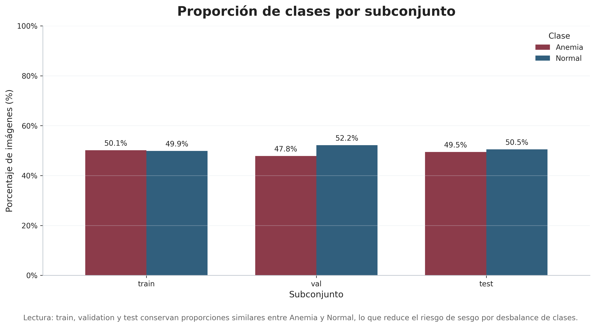
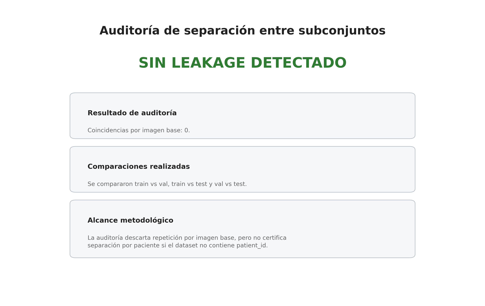
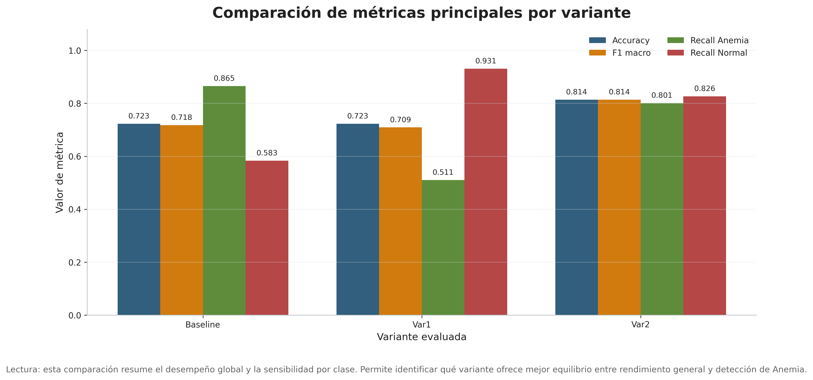
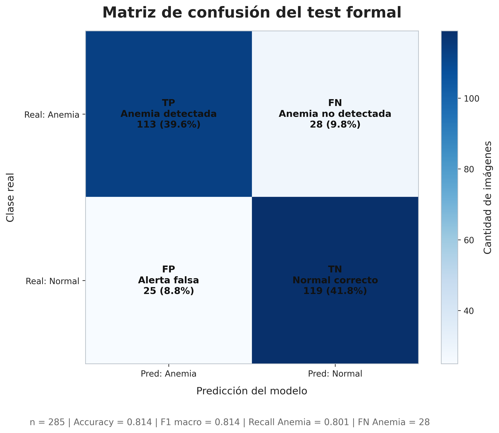
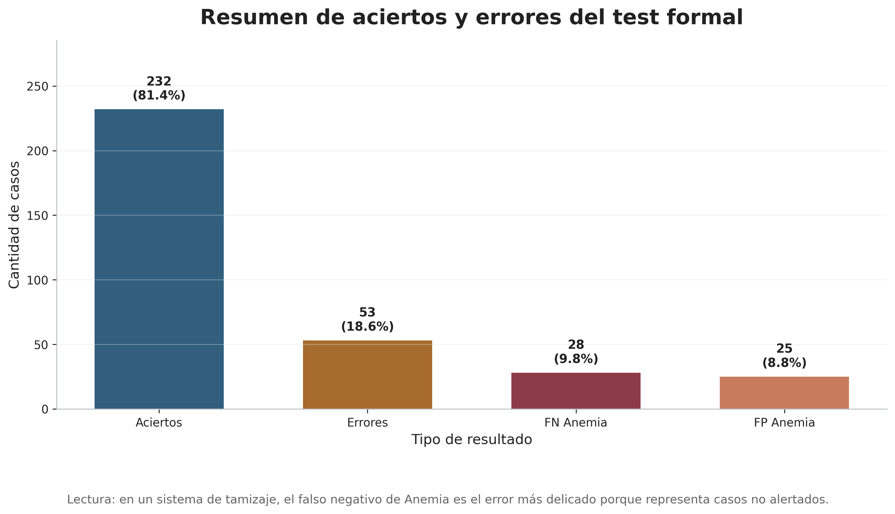
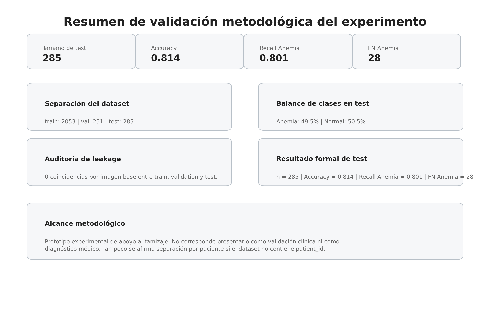

# Sistema de apoyo al tamizaje de anemia mediante análisis de conjuntiva palpebral

**Proyecto:** Detección de anemia a partir de imágenes de conjuntiva palpebral inferior  
**Notebook principal:** `cp_v3_semana6_pipeline.ipynb`  
**Rama recomendada:** `proy_dect_conj_v4`  
**Modelos:** YOLOv8n + EfficientNet-B0  
**Clases:** `Anemia` / `Normal`  
**Lenguaje:** Python 3.10  
**Frameworks:** PyTorch, Torchvision, Ultralytics YOLO, Scikit-learn, Pandas, Matplotlib  
**Autores:** John Rivera, Manuel Cochachin  

---

## 1. Resumen

Este repositorio contiene un pipeline de visión por computadora para apoyar el tamizaje experimental de anemia mediante imágenes de conjuntiva palpebral inferior.

La solución trabaja en dos etapas:

| Etapa | Modelo | Función |
|---|---|---|
| Detección de región de interés | YOLOv8n | Localiza la zona de conjuntiva palpebral inferior mediante bounding box. |
| Clasificación binaria | EfficientNet-B0 | Clasifica la imagen o el recorte ROI en `Anemia` o `Normal`. |

La versión actual del proyecto está alineada con el notebook:

```text
cp_v3_semana6_pipeline.ipynb
```

El resultado formal reportado en este README proviene únicamente del conjunto `test` formal de 285 imágenes. La carpeta `testImage` no se usa como evidencia principal porque corresponde a pruebas manuales pequeñas y no a una evaluación formal reproducible.

---

## 2. Estado actual del proyecto

La versión `v4` consolida:

| Componente | Estado |
|---|---|
| Dataset limpio con `data_clean.yaml` | Completado |
| Auditoría de separación train/val/test | Completado |
| Entrenamiento de YOLOv8n para ROI | Completado |
| Entrenamiento de EfficientNet-B0 sobre imagen completa | Completado |
| Entrenamiento de EfficientNet-B0 sobre ROI real | Completado |
| Evaluación end-to-end YOLO ROI + EfficientNet | Completado |
| Calibración de probabilidades | Completado |
| Selección de umbral con validación | Completado |
| Evaluación sobre test formal | Completado |
| Figuras finales para defensa de tesis | Completado |
| README actualizado con resultados del notebook v4 | Completado |

---

## 3. Objetivo general

Desarrollar un sistema experimental de apoyo al tamizaje de anemia usando visión por computadora, capaz de detectar la región de conjuntiva palpebral inferior y clasificar la muestra en `Anemia` o `Normal`.

---

## 4. Objetivos específicos

1. Organizar el dataset en subconjuntos `train`, `val` y `test`.
2. Validar que no exista fuga de datos evidente entre subconjuntos usando identificador base de imagen.
3. Entrenar un detector YOLOv8n para localizar la región de interés.
4. Entrenar un clasificador EfficientNet-B0 para clasificación binaria.
5. Comparar tres variantes: imagen completa, ROI desde etiqueta real y ROI detectada por YOLO.
6. Calibrar probabilidades usando validación, no test.
7. Evaluar el desempeño final únicamente sobre el conjunto `test` formal.
8. Generar evidencia visual y estadística defendible para exposición de tesis.

---

## 5. Dataset

El proyecto trabaja con un dataset en formato YOLOv8, organizado mediante:

```text
data_clean.yaml
```

Estructura esperada:

```text
dataset_clean/
├── train/
│   ├── images/
│   └── labels/
├── val/
│   ├── images/
│   └── labels/
└── test/
    ├── images/
    └── labels/
```

Distribución usada por el notebook:

| Split | Imágenes | Uso |
|---|---:|---|
| Train | 2053 | Entrenamiento |
| Validation | 251 | Validación, calibración y selección de umbral |
| Test formal | 285 | Evaluación final |
| Total | 2589 | Dataset procesado |

Distribución de entrenamiento:

| Clase | Imágenes |
|---|---:|
| Anemia | 1029 |
| Normal | 1024 |

---

## 6. Advertencia metodológica sobre el split

El notebook audita que no existan coincidencias por imagen base entre `train`, `val` y `test`.

Resultado defendible:

```text
Train vs Val  = 0 coincidencias
Train vs Test = 0 coincidencias
Val vs Test   = 0 coincidencias
```

Esto permite afirmar que no se detectó leakage por nombre base de imagen o duplicación directa entre splits.

Limitación objetiva:

```text
Si el dataset no contiene patient_id, no se puede afirmar split grupal por paciente.
```

Para una tesis o una validación clínica más fuerte, el split ideal debería hacerse por paciente o por sesión de captura, no solo por archivo.

---

## 7. Arquitectura del pipeline

```text
Imagen de entrada
    ↓
YOLOv8n
    ↓
Bounding box de conjuntiva
    ↓
Recorte ROI
    ↓
Transformación y normalización
    ↓
EfficientNet-B0
    ↓
Calibración de probabilidad
    ↓
Umbral de decisión
    ↓
Predicción final: Anemia / Normal
```

Variantes evaluadas:

| Variante | Entrada al clasificador | Descripción |
|---|---|---|
| Baseline | Imagen completa | EfficientNet-B0 clasifica la imagen completa redimensionada. |
| Var1 | ROI desde etiqueta real | EfficientNet-B0 clasifica el recorte generado desde la anotación YOLO real. |
| Var2 | ROI detectada por YOLO | YOLO detecta la ROI y EfficientNet-B0 clasifica el recorte detectado. |

---

## 8. Notebook principal

Archivo:

```text
cp_v3_semana6_pipeline.ipynb
```

Bloques principales del notebook:

| Bloque | Función |
|---:|---|
| 1 | Configuración central del proyecto |
| 2 | Utilidades generales y control de semilla |
| 3 | Lectura robusta de `data_clean.yaml` |
| 4 | Auditoría de leakage entre splits |
| 5 | Dataset PyTorch para imagen completa o ROI |
| 6 | Transformaciones de entrenamiento y evaluación |
| 7 | Definición del modelo EfficientNet-B0 |
| 8 | Métricas, calibración y selección de umbral |
| 9 | Entrenamiento y evaluación del clasificador |
| 10 | Entrenamiento/carga de YOLOv8n |
| 11 | Evaluación end-to-end YOLO ROI + EfficientNet |
| 12 | Inferencia individual |
| 13 | Generación de artefactos |
| 14 | Bloque final solo test formal |
| 15 | Bloque final definitivo de figuras para defensa |

---

## 9. Configuración relevante

Parámetros principales usados en el notebook:

| Parámetro | Valor |
|---|---:|
| `seed` | 42 |
| `quick_mode` | False |
| `data_yaml` | `data_clean.yaml` |
| `image_size` | 224 |
| `batch_size` | 16 |
| `learning_rate` | 1e-3 |
| `weight_decay` | 1e-4 |
| `yolo_imgsz` | 416 |
| `yolo_batch` | 2 |
| `yolo_epochs_real` | 10 |
| `classifier_epochs_real` | 40 |
| `early_stop_patience_real` | 8 |
| `yolo_conf_threshold` | 0.15 |
| `threshold_min` | 0.20 |
| `threshold_max` | 0.80 |
| `threshold_step` | 0.01 |

---

## 10. Entorno de ejecución

Entorno detectado en el notebook:

| Componente | Valor |
|---|---|
| Sistema operativo | Windows |
| Python | 3.10.0 |
| Entorno virtual | `.venv` |
| PyTorch | 2.12.0+cu126 |
| CUDA | 12.6 |
| GPU | NVIDIA GeForce GTX 1660 SUPER |
| VRAM | 6144 MiB |
| Ultralytics | 8.4.x |

---

## 11. Instalación

Crear entorno virtual:

```bash
# /Proyecto_Deteccion_Conjuntiva_v1/setup_env.sh
python -m venv .venv
```

Activar entorno en Git Bash:

```bash
# /Proyecto_Deteccion_Conjuntiva_v1/activate_gitbash.sh
source .venv/Scripts/activate
```

Instalar dependencias principales:

```bash
# /Proyecto_Deteccion_Conjuntiva_v1/install_deps.sh
python -m pip install --upgrade pip
python -m pip install numpy pandas matplotlib scikit-learn pillow pyyaml tqdm opencv-python ultralytics ipykernel
python -m pip install torch torchvision torchaudio
```

Registrar kernel para VS Code o Jupyter:

```bash
# /Proyecto_Deteccion_Conjuntiva_v1/register_kernel.sh
python -m ipykernel install --user --name anemia_env --display-name "Python 3.10 - Anemia Pipeline (.venv)"
```

---

## 12. Ejecución

Abrir en VS Code o Jupyter:

```text
cp_v3_semana6_pipeline.ipynb
```

Seleccionar kernel:

```text
Python 3.10 - Anemia Pipeline (.venv)
```

Ejecutar en orden:

```text
1. Celdas principales del pipeline.
2. results = main(CFG)
3. BLOQUE FINAL SOLO TEST FORMAL.
4. BLOQUE FINAL DEFINITIVO: FIGURAS PARA DEFENSA DE TESIS.
```

Salida principal:

```text
artifacts/week5_pipeline/
```

---

## 13. Resultados comparativos del notebook v4

Evaluación realizada sobre 285 imágenes del conjunto `test` formal.

| Variante | Entrada | Accuracy | F1 macro | Precision macro | Recall macro | Recall Anemia | Recall Normal | FP Normal→Anemia | FN Anemia→Normal | Detection rate | ms/img |
|---|---|---:|---:|---:|---:|---:|---:|---:|---:|---:|---:|
| Baseline | Imagen completa | 0.7228 | 0.7178 | 0.7429 | 0.7243 | 0.8652 | 0.5833 | 60 | 19 | 1.0000 | 23.47 |
| Var1 | ROI con bbox real/label | 0.7228 | 0.7090 | 0.7691 | 0.7206 | 0.5106 | 0.9306 | 10 | 69 | 1.0000 | 16.78 |
| Var2 | YOLO ROI + clasificador ROI | 0.8140 | 0.8140 | 0.8142 | 0.8139 | 0.8014 | 0.8264 | 25 | 28 | 1.0000 | 51.68 |

Resultado objetivo:

| Criterio | Mejor variante | Valor |
|---|---|---:|
| Mayor accuracy | Var2 | 81.40 % |
| Mayor F1 macro | Var2 | 81.40 % |
| Mayor precision macro | Var2 | 81.42 % |
| Mayor recall macro | Var2 | 81.39 % |
| Mayor recall de Anemia | Baseline | 86.52 % |
| Menor FN de Anemia | Baseline | 19 |
| Mejor flujo automatizado completo | Var2 | YOLO ROI + EfficientNet |

Interpretación brutalmente objetiva:

```text
Var2 es la mejor variante global porque obtiene el mayor accuracy y F1 macro.
Baseline detecta más casos de Anemia, pero lo hace a costa de más falsos positivos en Normal.
Var1 no es el flujo real de producción porque usa bbox real/label; sirve como comparación controlada.
Para una defensa de tesis, Var2 debe presentarse como el sistema integral, y Baseline debe mencionarse como referencia de sensibilidad en Anemia.
```

---

## 14. Resultado final del test formal para Var2

El bloque final del notebook genera la evaluación formal usando:

```text
artifacts/week5_pipeline/yolo_e2e/e2e_test_predictions.csv
```

Resumen:

| Métrica | Valor |
|---|---:|
| Total test formal | 285 |
| Aciertos | 232 |
| Errores | 53 |
| Accuracy | 0.814035 |
| Accuracy % | 81.40 % |
| Precision macro | 0.814182 |
| Recall macro | 0.813904 |
| F1 macro | 0.813953 |
| Umbral Anemia | 0.55 |

Métricas por clase:

| Clase | Precision | Recall | F1 | Support |
|---|---:|---:|---:|---:|
| Anemia | 0.818841 | 0.801418 | 0.810036 | 141 |
| Normal | 0.809524 | 0.826389 | 0.817869 | 144 |

Matriz de confusión:

| Real \ Predicción | Pred_Anemia | Pred_Normal |
|---|---:|---:|
| Real_Anemia | 113 | 28 |
| Real_Normal | 25 | 119 |

Lectura de la matriz:

```text
113 casos de Anemia fueron detectados correctamente.
28 casos de Anemia fueron clasificados como Normal.
25 casos Normal fueron clasificados como Anemia.
119 casos Normal fueron detectados correctamente.
```

Para tamizaje, los 28 falsos negativos de Anemia son el punto crítico que debe explicarse con cuidado, porque representan casos anémicos que el sistema no detectó.

---

## 15. Figuras generadas para defensa

El bloque final definitivo genera las figuras más limpias para sustentación en:

```text
artifacts/week5_pipeline/figuras_tesis_defensa_final/
```

Figuras principales:

```text
01_proporcion_clases_por_subconjunto.png
02_auditoria_no_leakage.png
03_metricas_principales_por_variante.png
04_matriz_confusion_test_formal.png
05_resumen_aciertos_errores_test_formal.png
06_panel_ejecutivo_validacion.png
```

### Figura 1. Proporción de clases por subconjunto



### Figura 2. Auditoría de no leakage



### Figura 3. Métricas principales por variante



### Figura 4. Matriz de confusión del test formal



### Figura 5. Resumen de aciertos y errores



### Figura 6. Panel ejecutivo de validación



---

## 16. Figuras complementarias del test formal

El bloque `BLOQUE FINAL SOLO TEST FORMAL` genera figuras complementarias en:

```text
artifacts/week5_pipeline/figuras_test_formal/grids/
```

Lista de salidas:

```text
01_matriz_confusion_test_formal.png
02_aciertos_errores_test_formal.png
03_distribucion_real_predicha_test_formal.png
04_roc_precision_recall_test_formal.png
05_probabilidades_calibracion_test_formal.png
06_confianza_aciertos_errores_test_formal.png
07_aciertos_anemia_test_formal.png
08_aciertos_normal_test_formal.png
09_errores_modelo_test_formal.png
10_falsos_negativos_anemia_test_formal.png
11_muestra_mixta_test_formal.png
```

Estadísticas generadas:

```text
artifacts/week5_pipeline/figuras_test_formal/estadisticas/
├── estadisticas_test_formal.csv
├── matriz_confusion_test_formal.csv
├── metricas_por_clase_test_formal.csv
├── predicciones_test_formal_usadas.csv
├── aciertos_test_formal.csv
├── errores_test_formal.csv
├── falsos_negativos_anemia_test_formal.csv
├── falsos_positivos_anemia_test_formal.csv
├── distribucion_real_predicha_test_formal.csv
└── estadisticas_curvas_test_formal.csv
```

---

## 17. Artefactos principales

```text
artifacts/week5_pipeline/
├── config_used.json
├── comparison_results.csv
├── formal_test_summary.md
├── pipeline_progress.md
├── pipeline_progress.json
├── test_comparison_summary.png
├── baseline_full/
├── roi_gt/
├── yolo_e2e/
├── evidence_pack/
├── figuras_test_formal/
└── figuras_tesis_defensa_final/
```

Artefactos clave:

| Archivo | Uso |
|---|---|
| `comparison_results.csv` | Comparación Baseline / Var1 / Var2 |
| `yolo_e2e/e2e_test_predictions.csv` | Predicciones formales del test |
| `figuras_test_formal/estadisticas/estadisticas_test_formal.csv` | Métricas finales |
| `figuras_test_formal/estadisticas/matriz_confusion_test_formal.csv` | Matriz de confusión |
| `figuras_tesis_defensa_final/REPORTE_FIGURAS_DEFENSA_FINAL.md` | Reporte de figuras finales |
| `pipeline_progress.md` | Bitácora de ejecución |
| `config_used.json` | Configuración usada |

---

## 18. Reproducibilidad

El pipeline fija semilla y controla componentes aleatorios:

```text
random
numpy
torch
torch.cuda
cudnn.deterministic
cudnn.benchmark = False
```

Semilla:

```text
seed = 42
```

La calibración y el umbral se seleccionan usando validación. El test formal se reserva para evaluación final.

Regla correcta:

```text
Train → entrenamiento
Validation → calibración y selección de umbral
Test → evaluación final
```

Regla incorrecta:

```text
No se debe ajustar el umbral mirando el test.
No se debe reportar testImage como resultado formal.
```

---

## 19. Inferencia individual

El notebook incluye flujo de inferencia individual:

```python
predict_single_image_e2e(...)
```

Salida esperada:

```text
status
prediction_id
prediction_name
prob_anemia
prob_normal
bbox_xyxy
confidence_yolo
output_image
```

Flujo:

```text
Imagen nueva
    ↓
YOLO detecta ROI
    ↓
Se recorta conjuntiva
    ↓
EfficientNet clasifica
    ↓
Se aplica calibración
    ↓
Se aplica umbral de Anemia
    ↓
Se genera resultado final
```

---

## 20. Qué subir y qué no subir a GitHub

Sí versionar:

```text
cp_v3_semana6_pipeline.ipynb
README.md
README_VALIDADO.md
data_clean.yaml
artifacts/week5_pipeline/comparison_results.csv
artifacts/week5_pipeline/formal_test_summary.md
artifacts/week5_pipeline/pipeline_progress.md
artifacts/week5_pipeline/figuras_test_formal/grids/*.png
artifacts/week5_pipeline/figuras_test_formal/estadisticas/*.csv
artifacts/week5_pipeline/figuras_tesis_defensa_final/*.png
artifacts/week5_pipeline/figuras_tesis_defensa_final/*.pdf
artifacts/week5_pipeline/figuras_tesis_defensa_final/*.md
```

No versionar:

```text
.venv/
__pycache__/
*.pyc
*.pt
*.pth
*.onnx
runs/
dataset_clean/
.ipynb_checkpoints/
*.cache
```

`.gitignore` recomendado:

```gitignore
# Entornos locales
.venv/
venv/
__pycache__/
*.pyc

# Datasets locales pesados
dataset_clean/
testImage/

# Runs de entrenamiento
runs/

# Pesos/modelos pesados
*.pt
*.pth
*.onnx

# Cachés
*.cache
.ipynb_checkpoints/

# Sistema
.DS_Store
Thumbs.db
```

---

## 21. Problema común: GitHub no renderiza el notebook

Si GitHub muestra:

```text
Unable to render code block
```

no significa que el archivo no exista. Significa que el notebook pesa demasiado o contiene outputs grandes.

Solución recomendada:

```bash
# /Proyecto_Deteccion_Conjuntiva_v1/limpiar_notebook_outputs.sh
jupyter nbconvert \
  --ClearOutputPreprocessor.enabled=True \
  --inplace cp_v3_semana6_pipeline.ipynb
```

Luego:

```bash
# /Proyecto_Deteccion_Conjuntiva_v1/subir_notebook_limpio.sh
git add cp_v3_semana6_pipeline.ipynb
git commit -m "limpia outputs del notebook semana 6"
git push
```

---

## 22. Comandos para subir este README

```bash
# /Proyecto_Deteccion_Conjuntiva_v1/subir_readme_v4.sh
cd ~/Documents/GitHub/Proyecto_Deteccion_Conjuntiva_v1 || exit 1

git switch proy_dect_conj_v4

git add README.md
git commit -m "actualiza README con resultados del notebook v4"
git push
```

Verificación:

```bash
# /Proyecto_Deteccion_Conjuntiva_v1/verificar_estado_git.sh
git status --short
git log --oneline -3
```

---

## 23. Conclusión

El pipeline v4 ya presenta un flujo completo de detección y clasificación:

```text
YOLOv8n detecta la ROI
EfficientNet-B0 clasifica el recorte
La probabilidad se calibra
El umbral se define con validación
El desempeño final se reporta solo con test formal
```

Resultado principal defendible:

```text
Accuracy final Var2: 81.40 %
F1 macro Var2: 81.40 %
Recall Anemia Var2: 80.14 %
Recall Normal Var2: 82.64 %
Test formal: 285 imágenes
Aciertos: 232
Errores: 53
```

Conclusión técnica:

```text
Var2 es la variante más coherente para presentar como sistema integral automatizado.
Baseline conserva mayor recall de Anemia, pero con más falsos positivos.
El sistema es experimental y no reemplaza pruebas clínicas de hemoglobina.
```
