# Sistema de apoyo al tamizaje de Anemia mediante Análisis de Conjuntiva Palpebral con YOLOv8n y EfficientNet-B0

**Proyecto de tesis:** Sistema de apoyo al tamizaje de anemia por conjuntiva palpebral mediante imágenes de conjuntiva palpebral inferior y clasificación binaria `Anemia` / `Normal`  
**Autores:** John Rivera, Manuel Cochachin  
**Línea de investigación:** Visión por computadora aplicada al procesamiento de imágenes biomédicas  
**Dataset base:** Anemia Detection v6 — Roboflow Universe  
**Notebook principal:** `cp_v3_semana6_pipeline.ipynb`  
**Modelos utilizados:** YOLOv8n + EfficientNet-B0  
**Lenguaje:** Python 3.10  
**Frameworks principales:** PyTorch, Torchvision, Ultralytics YOLO, Scikit-learn  

---

## Tabla de contenido

1. [Resumen del proyecto](#1-resumen-del-proyecto)
2. [Objetivos](#2-objetivos)
3. [Integrantes y responsabilidades](#3-integrantes-y-responsabilidades)
4. [Tareas resueltas](#4-tareas-resueltas)
5. [Fuente de datos](#5-fuente-de-datos)
6. [Estructura del dataset procesado](#6-estructura-del-dataset-procesado)
7. [Arquitectura general del pipeline](#7-arquitectura-general-del-pipeline)
8. [Notebook principal](#8-notebook-principal)
9. [Estructura recomendada del repositorio](#9-estructura-recomendada-del-repositorio)
10. [Entorno de ejecución](#10-entorno-de-ejecución)
11. [Instalación](#11-instalación)
12. [Ejecución](#12-ejecución)
13. [Configuración central](#13-configuración-central)
14. [Preprocesamiento y transformación de imágenes](#14-preprocesamiento-y-transformación-de-imágenes)
15. [Modelo detector de región de interés](#15-modelo-detector-de-región-de-interés)
16. [Modelo clasificador](#16-modelo-clasificador)
17. [Calibración y umbral de decisión](#17-calibración-y-umbral-de-decisión)
18. [Evaluación comparativa](#18-evaluación-comparativa)
19. [Gráficas y estadísticas del test formal](#19-gráficas-y-estadísticas-del-test-formal)
20. [Artefactos generados](#20-artefactos-generados)
21. [Reproducibilidad](#21-reproducibilidad)
22. [Checklist de validación Sprint 2](#22-checklist-de-validación-sprint-2)
23. [Inferencia individual](#23-inferencia-individual)
24. [Archivos recomendados para GitHub](#24-archivos-recomendados-para-github)
25. [Resultado consolidado](#25-resultado-consolidado)
26. [Referencia rápida](#26-referencia-rápida)

---

## 1. Resumen del proyecto

Este repositorio contiene la implementación de un pipeline de visión por computadora para procesar imágenes de conjuntiva palpebral inferior, localizar la región de interés y clasificar la muestra en dos clases: `Anemia` y `Normal`.

La solución integra dos componentes principales:

| Componente | Modelo | Función dentro del sistema |
|---|---|---|
| Detector de región de interés | YOLOv8n | Localiza la zona de conjuntiva mediante bounding box. |
| Clasificador visual | EfficientNet-B0 | Clasifica la imagen completa o el recorte ROI en `Anemia` / `Normal`. |

El pipeline implementa carga de datos, validación de estructura, auditoría de separación de subconjuntos, entrenamiento/carga de modelos, calibración de probabilidades, comparación de variantes, evaluación sobre el conjunto `test` formal y generación de gráficas estadísticas para revisión académica.

**Actualización importante:** este README queda alineado con la versión actual del cuaderno, donde la evidencia reportada se limita al **test formal**. No se reportan imágenes ni métricas de `testImage`, porque esa carpeta era una prueba visual manual pequeña y no debe usarse como resultado principal.

**Actualización Sprint 2:** el notebook ahora agrega un cierre metodológico auditable: `sprint2_validation_checklist.md/json`, huella SHA256 del dataset antes/después, balance por clase del split y validación explícita de que el test no se usa para ajustar decisiones.

---

## 2. Objetivos

### Objetivo general

Desarrollar un sistema basado en visión por computadora para clasificar imágenes de conjuntiva palpebral inferior en las clases `Anemia` y `Normal`, integrando detección automática de región de interés mediante YOLOv8n y clasificación visual mediante EfficientNet-B0.

### Objetivos específicos

1. Organizar el dataset en subconjuntos `train`, `val` y `test` bajo una estructura compatible con YOLOv8 y PyTorch.
2. Validar la estructura del dataset, la correspondencia entre imágenes y etiquetas, y la disponibilidad del entorno de ejecución.
3. Implementar una auditoría de separación de datos mediante identificador base de imagen.
4. Entrenar o cargar un detector YOLOv8n para localizar la región de conjuntiva palpebral inferior.
5. Implementar un clasificador EfficientNet-B0 para clasificación binaria de imágenes completas y recortes ROI.
6. Comparar tres variantes de procesamiento: imagen completa, ROI desde etiqueta y ROI detectada por YOLO.
7. Calibrar las probabilidades del clasificador y seleccionar el umbral de decisión usando validación.
8. Consolidar métricas, matrices de confusión, curvas ROC/Precision-Recall, calibración, distribución de probabilidades y grillas visuales **solo desde el test formal**.

---

## 3. Integrantes y responsabilidades

| Integrante | Rol principal en el proyecto |
|---|---|
| John Rivera | Implementación del pipeline, estructuración del dataset, entrenamiento/evaluación de modelos, consolidación de resultados y documentación técnica. |
| Manuel Cochachin | Apoyo en configuración del entorno, validación de ejecución, revisión de métricas, organización del avance y documentación académica. |

---

## 4. Tareas resueltas

Las tareas se organizan según el estado actual del notebook `cp_v3_semana6_pipeline.ipynb`, evitando mezclar resultados formales con pruebas manuales pequeñas.

| ID | Tarea desarrollada | Responsable | Estado | Evidencia en el repositorio |
|---:|---|---|---|---|
| 1 | Definición del pipeline de ingesta y estructura de datos | John Rivera | Completado | `data_clean.yaml`, `dataset_clean/` |
| 2 | Validación del entorno de ejecución y disponibilidad GPU/CUDA | Manuel Cochachin | Completado | Bloques de validación del notebook |
| 3 | Instalación y uso de dependencias principales | Manuel Cochachin | Completado | `.venv`, dependencias Python |
| 4 | Preparación de dataset con formato YOLOv8 | John Rivera | Completado | `images/`, `labels/`, anotaciones `.txt` |
| 5 | Auditoría de separación entre `train`, `val` y `test` | John Rivera | Completado | `split_leakage_audit.json` |
| 6 | Implementación de transformaciones y normalización de imágenes | Manuel Cochachin | Completado | Transformaciones PyTorch del notebook |
| 7 | Entrenamiento/carga del detector YOLOv8n para ROI | John Rivera | Completado | `runs/detect/week5_yolo_*/weights/best.pt` |
| 8 | Implementación del clasificador EfficientNet-B0 | John Rivera | Completado | Clase `AnemiaClassifier` |
| 9 | Evaluación Baseline con imagen completa | John Rivera | Completado | `artifacts/week5_pipeline/baseline_full/` |
| 10 | Evaluación Var1 con ROI desde etiqueta | John Rivera | Completado | `artifacts/week5_pipeline/roi_gt/` |
| 11 | Evaluación Var2 con ROI detectada por YOLO | Manuel Cochachin | Completado | `artifacts/week5_pipeline/yolo_e2e/` |
| 12 | Calibración de probabilidades y selección de umbral | Manuel Cochachin | Completado | `calibration.json`, `threshold.json` |
| 13 | Consolidación de métricas formales sobre `test` | John Rivera | Completado | `comparison_results.csv`, `formal_test_summary.md` |
| 14 | Generación de gráficas y estadísticas solo desde test formal | John Rivera | Completado | `artifacts/week5_pipeline/figuras_test_formal/` |
| 15 | Documentación final alineada a test formal | John Rivera, Manuel Cochachin | Completado | `README.md` |
| 16 | Checklist de validación Sprint 2 | John Rivera | Completado | `sprint2_validation_checklist.md/json` |
| 17 | Huella de dataset antes/después de evaluación | John Rivera | Completado | `dataset_fingerprint_before.json`, `dataset_fingerprint_after.json` |
| 18 | Balance de split por clase | John Rivera | Completado | `split_balance_report.json/csv` |

---

## 5. Fuente de datos

El proyecto utiliza como fuente base el conjunto de datos público:

| Campo | Detalle |
|---|---|
| Origen | Roboflow Universe |
| Nombre del dataset | Anemia Detection v6 |
| Fecha de exportación documentada | 3 de enero de 2026 |
| Licencia reportada | CC BY 4.0 |
| URL | `https://universe.roboflow.com/diabetic-prediction-by-tongue-image-classification/anemia-detection-u0dhr-rzmdb` |
| Formato de anotación | YOLOv8 |
| Clases | `Anemia`, `Normal` |

Formato de etiqueta YOLO utilizado:

```text
class_id x_center y_center width height
```

Clases del proyecto:

| ID | Clase |
|---:|---|
| 0 | Anemia |
| 1 | Normal |

---

## 6. Estructura del dataset procesado

El notebook trabaja con el archivo:

```text
data_clean.yaml
```

Este archivo referencia la versión procesada del dataset:

```text
dataset_clean/train
dataset_clean/val
dataset_clean/test
```

Distribución registrada en el pipeline vigente:

| Split | Imágenes | Uso dentro del pipeline |
|---|---:|---|
| Train | 2053 | Entrenamiento de YOLO y clasificadores. |
| Validation | 251 | Validación, calibración y selección de umbral. |
| Test | 285 | Evaluación final de desempeño. |
| Total | 2589 | Total de imágenes procesadas. |

Distribución del conjunto de entrenamiento para clasificación:

| Clase | Imágenes en train |
|---|---:|
| Anemia | 1029 |
| Normal | 1024 |

### Limpieza y validaciones aplicadas

| Proceso | Descripción |
|---|---|
| Validación de estructura | Verificación de carpetas `images/` y `labels/` por split. |
| Correspondencia imagen/label | Comprobación de pares imagen-anotación en formato YOLO. |
| Lectura de clases | Extracción de `class_id` desde archivos `.txt`. |
| Conversión de imagen | Lectura en RGB para procesamiento con PyTorch. |
| Redimensionamiento | Entrada uniforme de 224×224 para EfficientNet-B0. |
| Auditoría por imagen base | Revisión de coincidencias entre splits considerando nombres con patrón `nombre.rf.hash.jpg`. |

Resultado de auditoría de separación:

| Comparación | Coincidencias detectadas |
|---|---:|
| Train vs Validation | 0 |
| Train vs Test | 0 |
| Validation vs Test | 0 |

Archivo generado:

```text
artifacts/week5_pipeline/split_leakage_audit.json
```

---

## 7. Arquitectura general del pipeline

```text
Dataset limpio
    ↓
Validación de entorno
    ↓
Carga de train / val / test
    ↓
Auditoría de separación de datos
    ↓
Entrenamiento o carga de YOLOv8n
    ↓
Construcción de datasets PyTorch
    ↓
Entrenamiento de EfficientNet-B0
    ↓
Calibración con validación
    ↓
Evaluación sobre test formal
    ↓
Comparación de variantes
    ↓
Generación de gráficas y estadísticas formales
```

Flujo integral de inferencia:

```text
Imagen de entrada
    ↓
YOLOv8n
    ↓
Bounding box de conjuntiva
    ↓
Recorte ROI
    ↓
Normalización ImageNet
    ↓
EfficientNet-B0
    ↓
Calibración de probabilidad
    ↓
Aplicación de umbral
    ↓
Predicción final: Anemia / Normal
```

Variantes evaluadas:

| Variante | Entrada al clasificador | Descripción |
|---|---|---|
| Baseline | Imagen completa | EfficientNet-B0 recibe la imagen original redimensionada. |
| Var1 | ROI desde etiqueta | EfficientNet-B0 recibe el recorte generado desde la anotación YOLO real. |
| Var2 | ROI detectada por YOLO | YOLOv8n detecta la ROI y EfficientNet-B0 realiza la clasificación final. |

---

## 8. Notebook principal

Archivo principal:

```text
cp_v3_semana6_pipeline.ipynb
```

### Mejora Sprint 2 agregada al notebook

El cuaderno incorpora un bloque adicional de validación que produce evidencia trazable:

| Validación | Qué comprueba | Archivo generado |
|---|---|---|
| Split correcto | No hay coincidencias por imagen base y cada split conserva ambas clases | `split_leakage_audit.json`, `split_balance_report.json` |
| Fit solo en train | La aumentación queda solo en `train_tf`; `eval_tf` no contiene transformaciones aleatorias | `sprint2_validation_checklist.md/json` |
| Semillas y protocolo | `seed=42` y `protocol_version=sprint2_semana6_holdout_clean_v1` | `config_used.json` |
| Data sin cambios | SHA256 agregado del dataset antes y después de evaluar | `dataset_fingerprint_before.json`, `dataset_fingerprint_after.json` |
| Logs completos | Configuración, métricas, progreso y timestamp UTC | `pipeline_progress.*`, `comparison_results.csv`, `metrics_test.json` |

Bloques implementados:

| Bloque | Componente | Función principal |
|---:|---|---|
| 1 | Configuración central | Define rutas, parámetros, pesos, tamaño de imagen, umbrales y opciones de ejecución. |
| 2 | Utilidades generales | Control de semilla, rutas, guardado de artefactos y validación de entorno. |
| 3 | Lectura de `data_clean.yaml` | Carga rutas de entrenamiento, validación, prueba y nombres de clases. |
| 4 | Auditoría de datos | Verifica separación entre `train`, `val` y `test` por identificador base. |
| 5 | Dataset PyTorch | Construye datasets para imagen completa y ROI desde anotaciones YOLO. |
| 6 | Transformaciones | Aplica aumentación controlada en entrenamiento y normalización en validación/prueba. |
| 7 | Modelo | Define `AnemiaClassifier` con EfficientNet-B0. |
| 8 | Entrenamiento | Entrena, valida, guarda checkpoints y aplica early stopping. |
| 9 | Evaluación | Calcula métricas, matriz de confusión y tiempos de inferencia. |
| 10 | YOLO | Entrena o carga el detector de región de interés. |
| 11 | End-to-end | Evalúa imagen → YOLO ROI → EfficientNet → predicción final. |
| 12 | Inferencia individual | Clasifica una imagen nueva y genera salida visual anotada opcional. |
| 13 | Artefactos | Genera tablas, reportes formales y evidencia del test. |
| 14 | Bloque final solo test formal | Genera PNG y CSV desde el conjunto `test` formal, sin usar `testImage`. |

---

## 9. Estructura recomendada del repositorio

```text
Proyecto_Deteccion_Conjuntiva_v1/
│
├── cp_v3_semana6_pipeline.ipynb
├── README.md
├── data_clean.yaml
│
├── dataset_clean/
│   ├── train/
│   │   ├── images/
│   │   └── labels/
│   ├── val/
│   │   ├── images/
│   │   └── labels/
│   └── test/
│       ├── images/
│       └── labels/
│
├── runs/
│   └── detect/
│       └── week5_yolo_*/
│           └── weights/
│               ├── best.pt
│               └── last.pt
│
├── artifacts/
│   └── week5_pipeline/
│       ├── sprint2_validation_checklist.md
│       ├── sprint2_validation_checklist.json
│       ├── dataset_fingerprint_before.json
│       ├── dataset_fingerprint_after.json
│       ├── split_balance_report.json
│       ├── baseline_full/
│       ├── roi_gt/
│       ├── yolo_e2e/
│       ├── evidence_pack/
│       └── figuras_test_formal/
│           ├── grids/
│           └── estadisticas/
│
└── media/
    └── imágenes seleccionadas para visualización en GitHub
```

> `testImage/` no forma parte de la evaluación formal reportada en este README. Si existe en el proyecto, debe considerarse una carpeta auxiliar local, no una fuente de métricas principales.

---

## 10. Entorno de ejecución

Entorno registrado por el notebook:

| Componente | Valor |
|---|---|
| Sistema operativo | Windows |
| Python | 3.10.0 |
| Entorno virtual | `.venv` |
| PyTorch | 2.11.0+cu126 |
| CUDA | 12.6 |
| GPU | NVIDIA GeForce GTX 1660 SUPER |
| VRAM | 6.44 GB |
| Ultralytics | 8.4.48 |

---

## 11. Instalación

Crear entorno virtual:

```bash
python -m venv .venv
```

Activar entorno en Windows PowerShell:

```powershell
.\.venv\Scripts\activate
```

Activar entorno en Git Bash:

```bash
source .venv/Scripts/activate
```

Instalar dependencias principales:

```bash
python -m pip install --upgrade pip
python -m pip install numpy pandas matplotlib scikit-learn pillow pyyaml tqdm opencv-python ultralytics ipykernel
python -m pip install torch torchvision torchaudio
```

Registrar kernel para Jupyter o VS Code:

```bash
python -m ipykernel install --user --name anemia_env --display-name "Python 3.10 - Anemia Pipeline (.venv)"
```

---

## 12. Ejecución

Abrir el notebook:

```text
cp_v3_semana6_pipeline.ipynb
```

Seleccionar el kernel:

```text
Python 3.10 - Anemia Pipeline (.venv)
```

Ejecutar las celdas en orden. El punto de entrada del pipeline principal es:

```python
if __name__ == "__main__":
    warnings.filterwarnings("ignore", category=UserWarning)
    results = main(CFG)
```

Después de `results = main(CFG)`, ejecutar el bloque final:

```text
BLOQUE FINAL SOLO TEST FORMAL
```

Este bloque genera únicamente:

```text
PNG de métricas y evidencia visual del test formal
CSV de estadísticas y predicciones usadas
```

No genera HTML, Markdown ni reportes manuales de `testImage`.

Carpeta principal de salida:

```text
artifacts/week5_pipeline/
```

---

## 13. Configuración central

La configuración principal se define en:

```python
PipelineConfig
```

Parámetros registrados:

| Parámetro | Valor |
|---|---:|
| `seed` | 42 |
| `protocol_version` | sprint2_semana6_holdout_clean_v1 |
| `split_strategy` | estratificado_por_clase_con_auditoria_por_imagen_base |
| `fit_scope_policy` | fit_only_train / val para calibración / test solo final |
| `image_size` | 224 |
| `roi_margin` | 0.08 |
| `yolo_imgsz` | 416 |
| `yolo_batch` | 2 |
| `yolo_conf_threshold` | 0.15 |
| `batch_size` | 16 |
| `learning_rate` | 1e-3 |
| `weight_decay` | 1e-4 |
| `threshold_min` | 0.20 |
| `threshold_max` | 0.80 |
| `threshold_step` | 0.01 |

Archivo de configuración generado:

```text
artifacts/week5_pipeline/config_used.json
```

---

## 14. Preprocesamiento y transformación de imágenes

### Transformaciones de entrenamiento

```text
Resize(224 x 224)
RandomHorizontalFlip(p=0.5)
RandomRotation(8°)
ColorJitter(brightness=0.10, contrast=0.10, saturation=0.02, hue=0.0)
RandomAffine(translate=0.05, scale=0.95–1.05)
ToTensor()
Normalize(ImageNet mean/std)
```

### Transformaciones de validación y prueba

```text
Resize(224 x 224)
ToTensor()
Normalize(ImageNet mean/std)
```

Valores de normalización:

```text
mean = [0.485, 0.456, 0.406]
std  = [0.229, 0.224, 0.225]
```

---

## 15. Modelo detector de región de interés

Detector utilizado:

```python
YOLO("yolov8n.pt")
```

Salida esperada:

```text
runs/detect/week5_yolo_*/weights/best.pt
```

Métricas registradas en validación:

| Clase | Images | Instances | Box Precision | Recall | mAP50 | mAP50-95 |
|---|---:|---:|---:|---:|---:|---:|
| all | 251 | 251 | 0.337 | 0.590 | 0.335 | 0.177 |
| Anemia | 120 | 120 | 0.207 | 0.617 | 0.262 | 0.128 |
| Normal | 131 | 131 | 0.467 | 0.563 | 0.407 | 0.226 |

Velocidad registrada por imagen:

| Etapa | Tiempo |
|---|---:|
| Preprocess | 0.3 ms |
| Inference | 3.3 ms |
| Postprocess | 1.4 ms |

---

## 16. Modelo clasificador

Clasificador implementado:

```python
AnemiaClassifier
```

Arquitectura base:

```text
EfficientNet-B0
```

Características:

| Elemento | Configuración |
|---|---|
| Backbone | EfficientNet-B0 |
| Pesos base | ImageNet |
| Salida | 2 clases |
| Loss | CrossEntropyLoss |
| Optimizador | AdamW |
| Scheduler | ReduceLROnPlateau |
| Checkpoint | Mejor modelo por validación |
| Calibración | Temperature Scaling |
| Umbral | Seleccionado con validación |

Parámetros registrados:

| Modelo | Parámetros totales | Parámetros entrenables |
|---|---:|---:|
| EfficientNet-B0 | 4,010,110 | 2,562 |

---

## 17. Calibración y umbral de decisión

Las probabilidades del clasificador se calibran con Temperature Scaling usando el conjunto de validación.

| Variante | Temperatura | Umbral para `Anemia` |
|---|---:|---:|
| Baseline | 1.1206 | 0.48 |
| Var1 | 1.1229 | 0.61 |
| Var2 | 1.1499 | 0.53 |

Regla de decisión:

```text
Si P(Anemia) >= umbral definido → Anemia
Si P(Anemia) <  umbral definido → Normal
```

---

## 18. Evaluación comparativa

Evaluación realizada sobre **285 imágenes del conjunto `test` formal**.

| Variante | Entrada | Accuracy | F1 macro | Precision macro | Recall macro | Recall Anemia | Recall Normal | FN Anemia | FP Anemia | Detection rate | ms/img |
|---|---|---:|---:|---:|---:|---:|---:|---:|---:|---:|---:|
| Baseline | Imagen completa | 0.6982 | 0.6978 | 0.7002 | 0.6987 | 0.7447 | 0.6528 | 36 | 50 | 1.0000 | 20.13 |
| Var1 | ROI con bbox real/label | 0.7333 | 0.7301 | 0.7426 | 0.7323 | 0.6312 | 0.8333 | 52 | 24 | 1.0000 | 14.99 |
| Var2 | YOLO ROI + clasificador ROI | 0.6807 | 0.6776 | 0.6899 | 0.6818 | 0.7872 | 0.5764 | 30 | 61 | 0.9825 | 43.03 |

Resultado consolidado por criterio:

| Criterio | Variante | Resultado |
|---|---|---:|
| Mayor accuracy | Var1 | 0.7333 |
| Mayor F1 macro | Var1 | 0.7301 |
| Mayor recall de Anemia | Var2 | 0.7872 |
| Menor cantidad de FN Anemia | Var2 | 30 |
| Menor tiempo por imagen | Var1 | 14.99 ms/img |
| Flujo integral automatizado | Var2 | YOLO ROI + EfficientNet |

Matrices de confusión:

```text
Baseline — Imagen completa
[[105, 36],
 [ 50, 94]]

Var1 — ROI desde etiqueta real
[[ 89, 52],
 [ 24,120]]

Var2 — YOLO ROI + EfficientNet
[[111, 30],
 [ 61, 83]]
```

---

## 19. Gráficas y estadísticas del test formal

Las gráficas actuales se generan únicamente desde el **test formal** mediante el bloque final del notebook. No se usa `testImage`.

Carpeta de imágenes:

```text
artifacts/week5_pipeline/figuras_test_formal/grids/
```

Carpeta de estadísticas:

```text
artifacts/week5_pipeline/figuras_test_formal/estadisticas/
```

### Figuras generadas

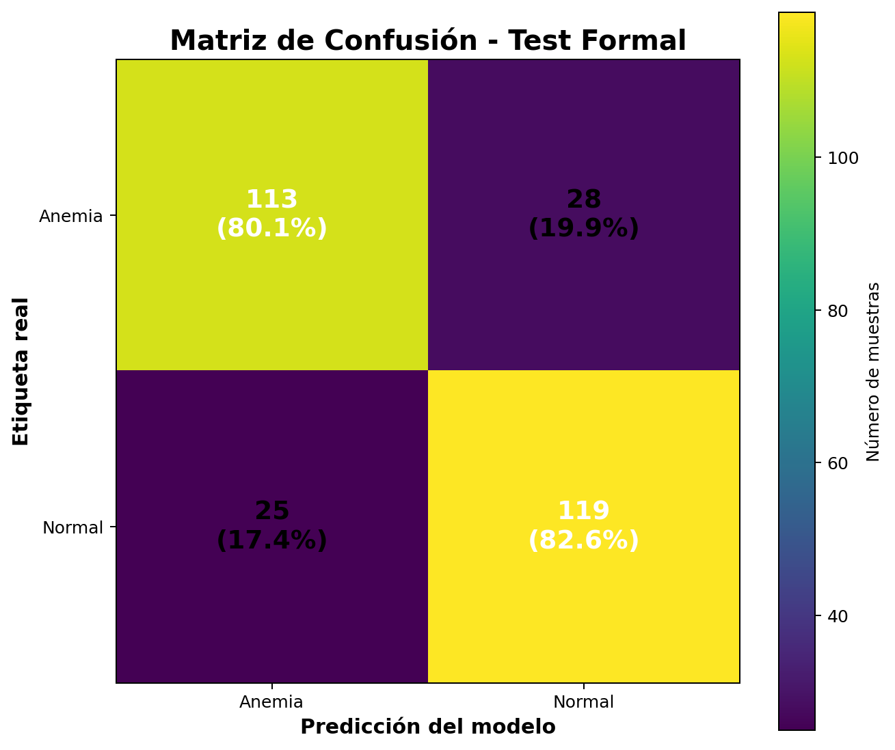

**Figura 1. Matriz de confusión del conjunto test formal.**

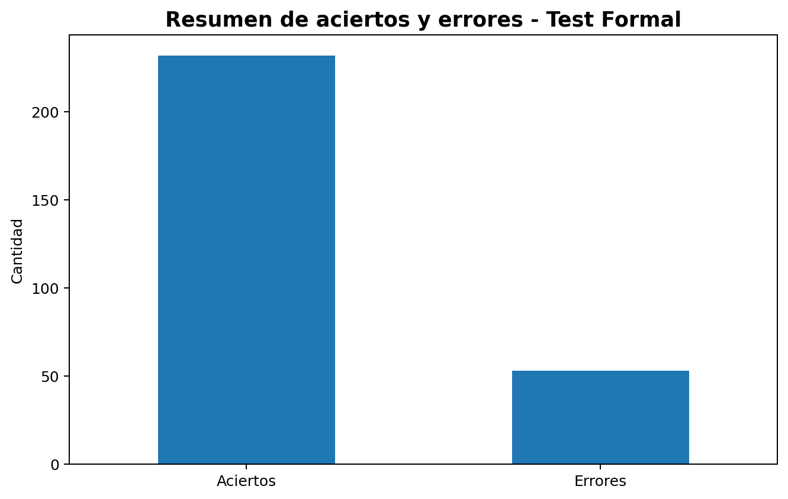

**Figura 2. Resumen de aciertos y errores del test formal.**

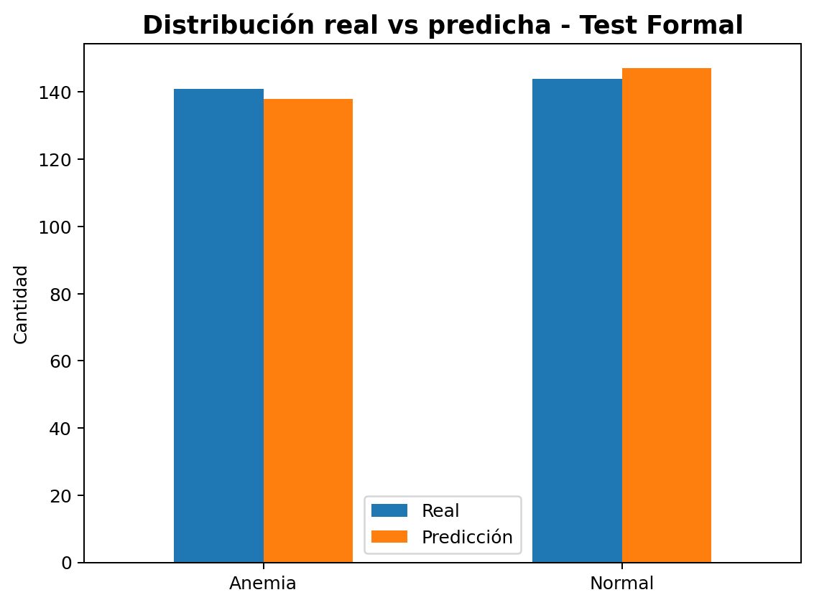

**Figura 3. Distribución de clases reales frente a predicciones del modelo.**

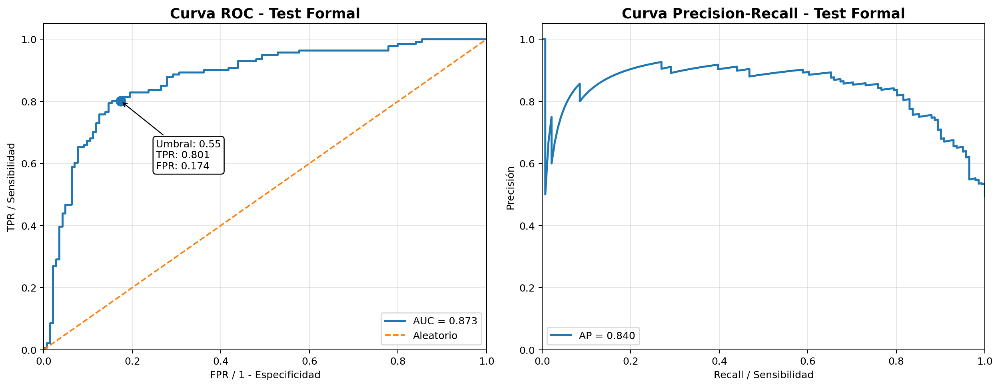

**Figura 4. Curvas ROC y Precision-Recall del clasificador de anemia.**

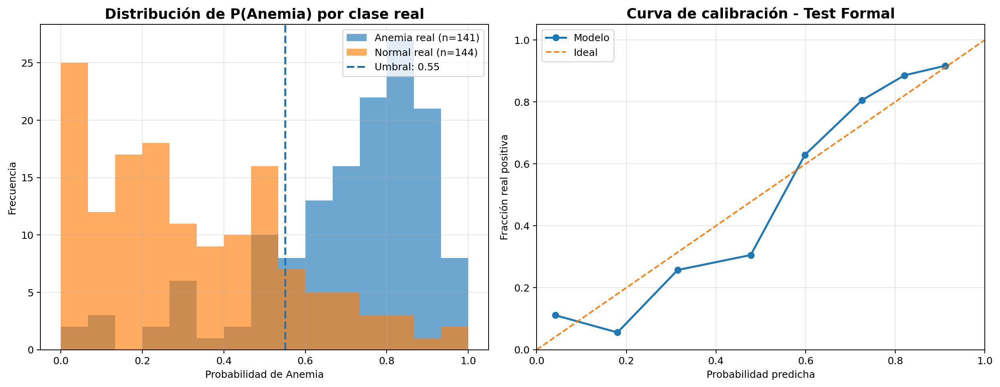

**Figura 5. Distribución de probabilidades y curva de calibración.**

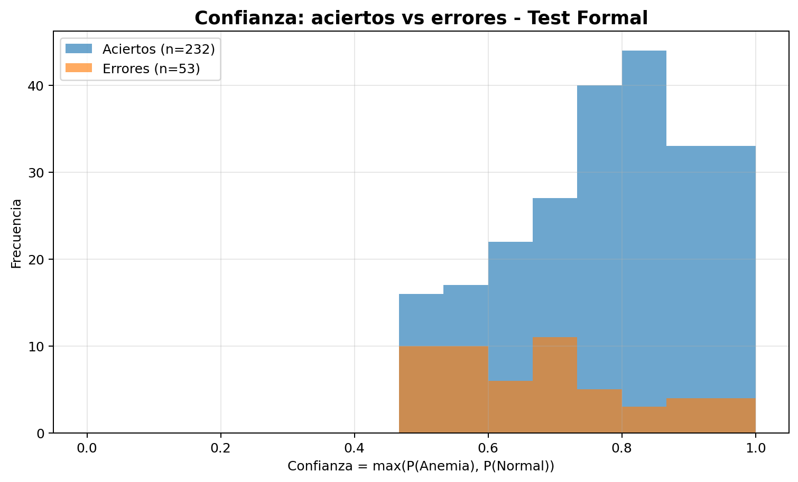

**Figura 6. Comparación de confianza entre aciertos y errores.**

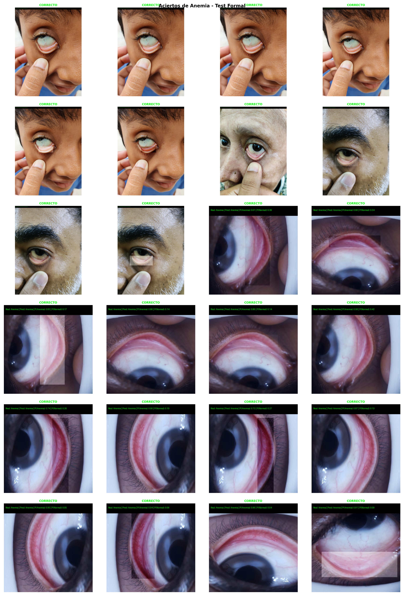

**Figura 7. Aciertos de la clase Anemia dentro del test formal.**

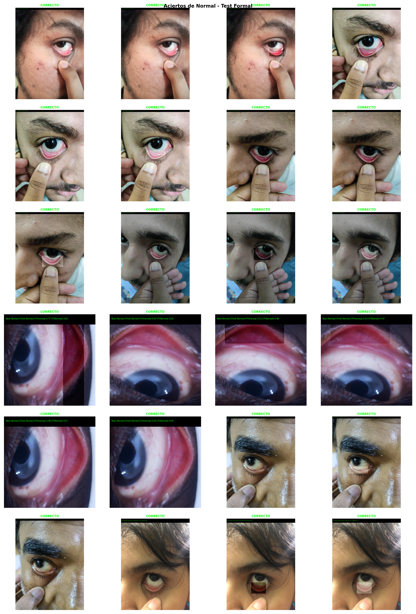

**Figura 8. Aciertos de la clase Normal dentro del test formal.**

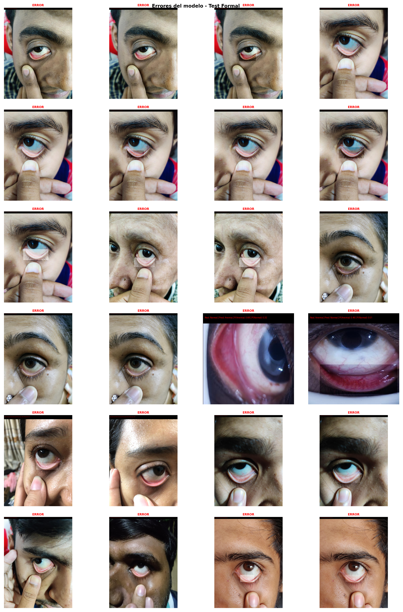

**Figura 9. Errores del modelo dentro del test formal.**

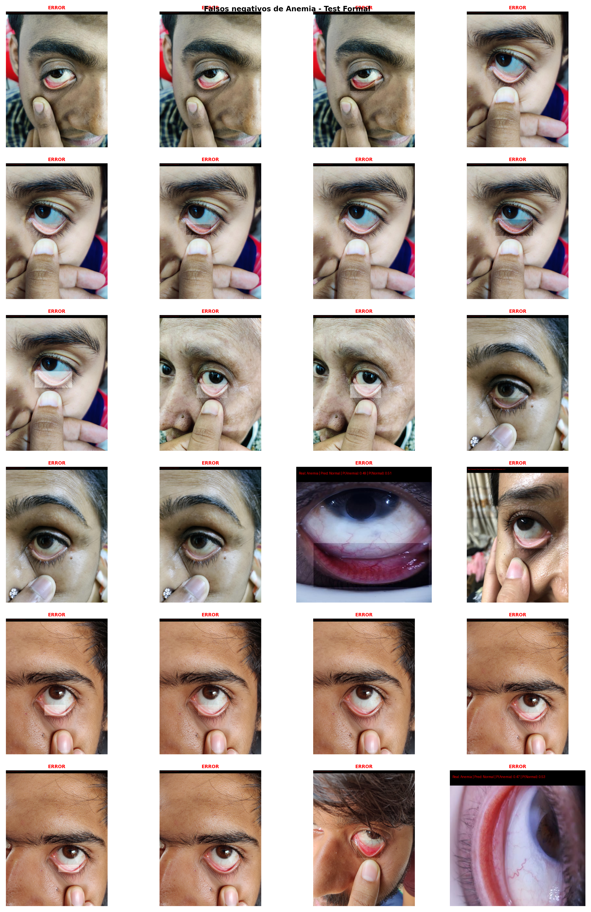

**Figura 10. Falsos negativos de Anemia dentro del test formal.**

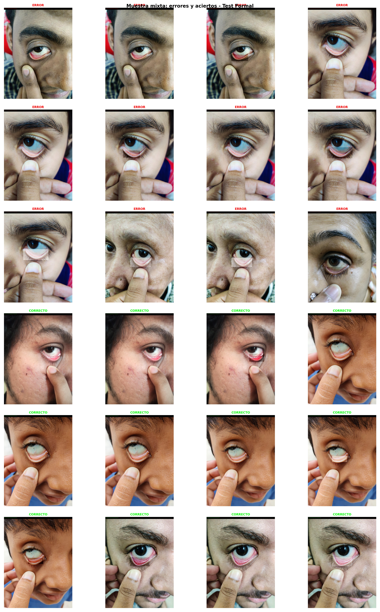

**Figura 11. Muestra mixta de aciertos y errores del test formal.**

### Estadísticas generadas

```text
artifacts/week5_pipeline/figuras_test_formal/estadisticas/
├── estadisticas_test_formal.csv
├── matriz_confusion_test_formal.csv
├── metricas_por_clase_test_formal.csv
├── predicciones_test_formal_usadas.csv
├── aciertos_test_formal.csv
├── errores_test_formal.csv
├── falsos_negativos_anemia_test_formal.csv
├── falsos_positivos_anemia_test_formal.csv
├── distribucion_real_predicha_test_formal.csv
└── estadisticas_curvas_test_formal.csv
```

### Nota metodológica

La carpeta `testImage` fue retirada de la documentación de resultados porque contiene una prueba manual pequeña. Para sustentar el desempeño del modelo se debe reportar el conjunto `test` formal de 285 imágenes.

---

## 20. Artefactos generados

```text
artifacts/week5_pipeline/
├── config_used.json
├── split_leakage_audit.json
├── split_balance_report.json
├── split_balance_report.csv
├── dataset_fingerprint_before.json
├── dataset_fingerprint_before.csv
├── dataset_fingerprint_after.json
├── dataset_fingerprint_after.csv
├── sprint2_validation_checklist.json
├── sprint2_validation_checklist.md
├── comparison_results.csv
├── formal_test_summary.md
├── README_semana5.md
├── pipeline_progress.md
├── pipeline_progress.json
├── test_comparison_summary.png
│
├── baseline_full/
│   ├── best.pt
│   └── metrics_test.json
│
├── roi_gt/
│   ├── best.pt
│   └── metrics_test.json
│
├── yolo_e2e/
│   ├── e2e_test_predictions.csv
│   ├── metrics_test.json
│   ├── calibration.json
│   ├── threshold.json
│   └── e2e_calibration.pt
│
├── evidence_pack/
│   └── 08_sample_predictions/
│       ├── sample_predictions.csv
│       └── *.png
│
└── figuras_test_formal/
    ├── grids/
    │   ├── 01_matriz_confusion_test_formal.png
    │   ├── 02_aciertos_errores_test_formal.png
    │   ├── 03_distribucion_real_predicha_test_formal.png
    │   ├── 04_roc_precision_recall_test_formal.png
    │   ├── 05_probabilidades_calibracion_test_formal.png
    │   ├── 06_confianza_aciertos_errores_test_formal.png
    │   ├── 07_aciertos_anemia_test_formal.png
    │   ├── 08_aciertos_normal_test_formal.png
    │   ├── 09_errores_modelo_test_formal.png
    │   ├── 10_falsos_negativos_anemia_test_formal.png
    │   └── 11_muestra_mixta_test_formal.png
    │
    └── estadisticas/
        ├── estadisticas_test_formal.csv
        ├── matriz_confusion_test_formal.csv
        ├── metricas_por_clase_test_formal.csv
        ├── predicciones_test_formal_usadas.csv
        ├── aciertos_test_formal.csv
        ├── errores_test_formal.csv
        ├── falsos_negativos_anemia_test_formal.csv
        ├── falsos_positivos_anemia_test_formal.csv
        ├── distribucion_real_predicha_test_formal.csv
        └── estadisticas_curvas_test_formal.csv
```

---

## 21. Reproducibilidad

Semilla global:

```text
seed = 42
```

Componentes controlados:

```text
random
numpy
torch
torch.cuda
cudnn.deterministic
cudnn.benchmark = False
```

Archivos de trazabilidad:

```text
artifacts/week5_pipeline/config_used.json
artifacts/week5_pipeline/pipeline_progress.md
artifacts/week5_pipeline/pipeline_progress.json
artifacts/week5_pipeline/figuras_test_formal/estadisticas/predicciones_test_formal_usadas.csv
```

---

## 22. Checklist de validación Sprint 2

Este bloque responde directamente al checklist de la diapositiva de Sprint 2. La validación no cambia el modelo; cambia la **calidad de la evidencia**.

### Checklist implementado

| Punto del checklist | Implementación en el notebook | Evidencia generada |
|---|---|---|
| Split correcto | Auditoría por imagen base + balance por clase en train/val/test | `split_leakage_audit.json`, `split_balance_report.json/csv` |
| Fit solo en train | Aumentación solo en `train_tf`; `eval_tf` limpio; calibración y umbral solo con validación | `sprint2_validation_checklist.md/json` |
| Seeds fijadas y mismo protocolo | `seed=42`, `cudnn.deterministic=True`, `protocol_version` registrado | `config_used.json` |
| Sin cambios de data entre baseline y evaluación final | Huella SHA256 del dataset antes y después | `dataset_fingerprint_before.json`, `dataset_fingerprint_after.json` |
| Logs completos | Configuración, progreso, métricas, timestamp UTC y resumen final | `pipeline_progress.*`, `comparison_results.csv`, `metrics_test.json`, `sprint2_validation_checklist.md` |

### Cómo ejecutarlo

Ejecutar el notebook en orden:

```text
1. Celdas principales del pipeline.
2. results = main(CFG)
3. BLOQUE FINAL SOLO TEST FORMAL
4. BLOQUE DE CIERRE - CHECKLIST VALIDACIÓN SPRINT 2
```

El cierre genera:

```text
artifacts/week5_pipeline/sprint2_validation_checklist.md
artifacts/week5_pipeline/sprint2_validation_checklist.json
artifacts/week5_pipeline/dataset_fingerprint_before.json
artifacts/week5_pipeline/dataset_fingerprint_after.json
artifacts/week5_pipeline/split_balance_report.json
```

### Criterio de aprobación

El checklist solo debe defenderse como válido si:

```text
dataset_unchanged_between_before_after = true
overlaps train/val/test = 0
eval_tf no tiene transformaciones aleatorias
seed y protocol_version están registrados
comparison_results.csv y metrics_test.json existen
```

### Limitación metodológica objetiva

El dataset permite auditar leakage por **imagen base**. Si no existe un `patient_id`, no se debe afirmar que el split es grupal por paciente. Para tesis o producción médica, el split correcto debería ser por paciente o por adquisición clínica, no solo por nombre de imagen.


## 23. Inferencia individual

Función principal:

```python
predict_single_image_e2e(...)
```

Entradas:

```text
Ruta de imagen
Detector YOLO
Clasificador EfficientNet
Transformación de evaluación
Umbral calibrado
```

Salida estructurada:

```text
status
prediction_id
prediction_name
prob_anemia
prob_normal
bbox_xyxy
confidence_yolo
imagen anotada opcional
```

Flujo interno:

```text
1. Leer imagen.
2. Detectar ROI con YOLOv8n.
3. Recortar región de interés.
4. Aplicar transformación de evaluación.
5. Ejecutar EfficientNet-B0.
6. Aplicar calibración.
7. Aplicar umbral de Anemia.
8. Generar resultado estructurado.
```

---

## 24. Archivos recomendados para GitHub

Versionar:

```text
cp_v3_semana6_pipeline.ipynb
README.md
data_clean.yaml
media/
artifacts/week5_pipeline/comparison_results.csv
artifacts/week5_pipeline/formal_test_summary.md
artifacts/week5_pipeline/test_comparison_summary.png
artifacts/week5_pipeline/pipeline_progress.md
artifacts/week5_pipeline/figuras_test_formal/grids/*.png
artifacts/week5_pipeline/figuras_test_formal/estadisticas/*.csv
```

No versionar archivos pesados o locales:

```text
.venv/
__pycache__/
*.pt
*.pth
runs/
dataset_clean/
.ipynb_checkpoints/
*.cache
```

Ejemplo de `.gitignore`:

```gitignore
.venv/
__pycache__/
*.pyc
*.pyo
*.pyd
.ipynb_checkpoints/

# Pesos y corridas pesadas
*.pt
*.pth
runs/

# Dataset local
Dataset/
dataset/
dataset_clean/
train/
valid/
val/
test/

# Pruebas manuales locales no usadas como resultado formal
testImage/
manual_testImage_predictions/
manual_testImage_simple/

# Cachés
*.cache
*.tmp

# Sistema operativo
.DS_Store
Thumbs.db
```

---

## 25. Resultado consolidado

El repositorio presenta un pipeline integral de clasificación de imágenes de conjuntiva palpebral con tres variantes comparables. La variante `Var1` registra el mayor desempeño global en accuracy y F1 macro, mientras que la variante `Var2` representa el flujo automatizado basado en detección de ROI con YOLOv8n y clasificación con EfficientNet-B0.

Resumen principal:

```text
Mejor accuracy:             Var1 = 73.33 %
Mejor F1 macro:             Var1 = 73.01 %
Mejor recall Anemia:        Var2 = 78.72 %
Menor FN Anemia:            Var2 = 30
Pipeline integral completo: Var2 = YOLO ROI + EfficientNet
```

Interpretación objetiva:

```text
Var1 es la mejor variante para desempeño global porque utiliza ROI real desde etiqueta.
Var2 es la variante más representativa del flujo real automatizado, porque usa YOLO para detectar la ROI.
Para un sistema de tamizaje, el indicador más sensible es el recall de Anemia y la reducción de falsos negativos.
```

Nota clínica y metodológica:

```text
Este sistema es un apoyo experimental de visión por computadora. No reemplaza una prueba clínica de hemoglobina ni constituye diagnóstico médico independiente.
No afirmes split grupal por paciente si el dataset no contiene patient_id. Lo defendible aquí es auditoría por imagen base + balance de clase.
```

---

## 26. Referencia rápida

| Recurso | Ruta |
|---|---|
| Notebook principal | `cp_v3_semana6_pipeline.ipynb` |
| Dataset limpio | `dataset_clean/` |
| Configuración de datos | `data_clean.yaml` |
| Resultados principales | `artifacts/week5_pipeline/` |
| Predicciones formales E2E | `artifacts/week5_pipeline/yolo_e2e/e2e_test_predictions.csv` |
| Gráficas del test formal | `artifacts/week5_pipeline/figuras_test_formal/grids/` |
| Estadísticas del test formal | `artifacts/week5_pipeline/figuras_test_formal/estadisticas/` |
| Pesos YOLO | `runs/detect/week5_yolo_*/weights/best.pt` |
| Pesos clasificador ROI | `artifacts/week5_pipeline/roi_gt/best.pt` |
| Evidencia para README | `artifacts/week5_pipeline/figuras_test_formal/grids/` |
| Checklist Sprint 2 | `artifacts/week5_pipeline/sprint2_validation_checklist.md` |
| Huella de dataset | `artifacts/week5_pipeline/dataset_fingerprint_before.json`, `dataset_fingerprint_after.json` |
| Balance de split | `artifacts/week5_pipeline/split_balance_report.json` |
