# Checklist de validación Sprint 2

Generado UTC: `2026-05-30T01:35:41+00:00`  
Estado global: **FALLA**  
Modo fallback: `False`  
Seed: `42`  
Protocolo: `semana6_sprint2_validation_fallback`

## Checklist

                                                 item            estado  aprobado                                                                                  evidencia                                                                                                                     lectura_objetiva
                                       Split correcto OK_CON_LIMITACION      True                             split_leakage_audit_final.json + split_balance_report.json/csv                          Sin leakage por imagen base y con balance razonable. No certifica split grupal por paciente sin patient_id.
                                    Fit solo en train OK_CON_LIMITACION     False                                                 build_transforms(CFG): eval_tf sin Random* Validación/test no deben tener augmentación aleatoria ni ajuste de parámetros. Si no existe build_transforms, queda como limitación.
         Seeds fijadas y mismo protocolo que Semana 5                OK      True                                         CFG.seed + CFG.protocol_version + config_used.json                                                   seed=42; protocol_version=semana6_sprint2_validation_fallback; fallback_mode=False
Sin cambios de data entre baseline y evaluación final             FALLA     False                          dataset_fingerprint_before.json vs dataset_fingerprint_after.json                                                 Si falta fingerprint_before o cambia el hash, no puedes defender comparación limpia.
                                       Logs completos                OK      True config_used.json, comparison_results.csv, metrics_test.json, figuras y CSV del test formal                                                                     metrics_test_json=0; png_formales=11; csv_formales=10; missing=0

## Huella de dataset

| Momento | aggregate_sha256 |
|---|---|
| Before | `None` |
| After | `24dc44b50034a0dda5410d9f22d1a29fca9029d3ce4b7975fe1d70e0fb611790` |

## Balance por split

split  class_id class_name  count      pct  images_total  images_labeled  missing_label_count  empty_label_count  multi_object_label_count
train         0     Anemia   1029 0.501218          2053            2053                    0                  0                         0
train         1     Normal   1024 0.498782          2053            2053                    0                  0                         0
  val         0     Anemia    120 0.478088           251             251                    0                  0                         0
  val         1     Normal    131 0.521912           251             251                    0                  0                         0
 test         0     Anemia    141 0.494737           285             285                    0                  0                         0
 test         1     Normal    144 0.505263           285             285                    0                  0                         0

## Comparación de métricas

experiment                  input_type status  accuracy  f1_macro  precision_macro  recall_macro  recall_anemia  recall_normal  fp_normal_as_anemia  fn_anemia_as_normal  detection_failures  detection_rate  ms_per_image  support_total
  Baseline             Imagen completa     OK  0.698246  0.697944         0.699718      0.698655       0.737589       0.659722                   49                   37                   0        1.000000     44.768779            285
      Var1     ROI con bbox real/label     OK  0.733333  0.731585         0.737956      0.732565       0.659574       0.805556                   28                   48                   0        1.000000     30.095998            285
      Var2 YOLO ROI + clasificador ROI     OK  0.687719  0.684676         0.693430      0.686761       0.595745       0.777778                   32                   57                   3        0.989474     90.331126            285

## Figuras de validación generadas

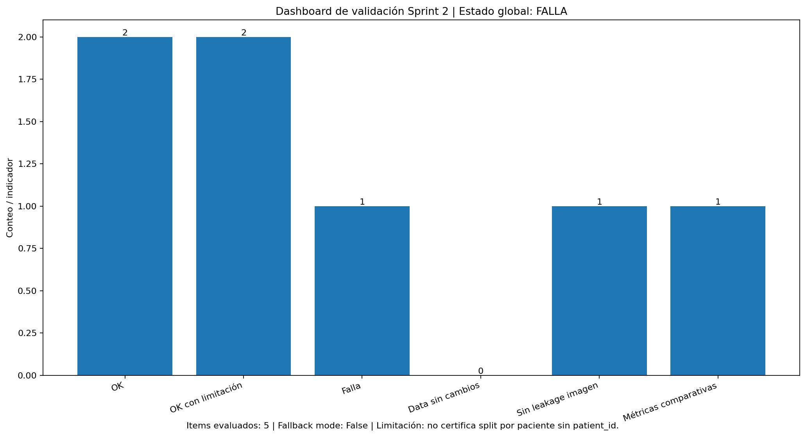
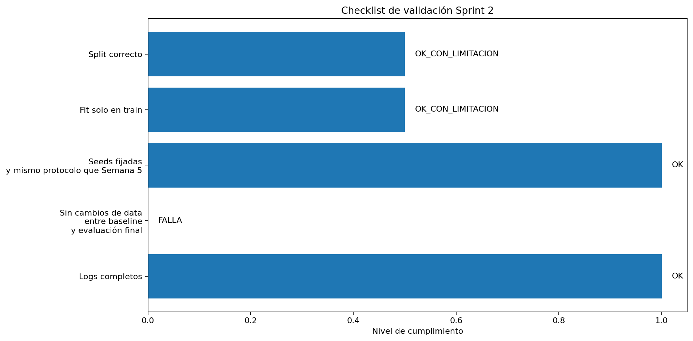
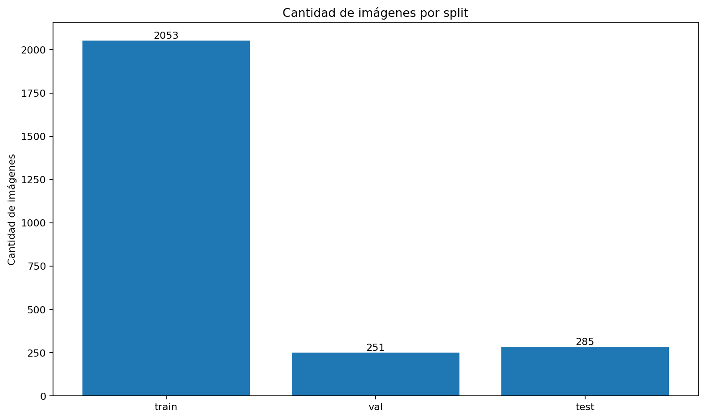
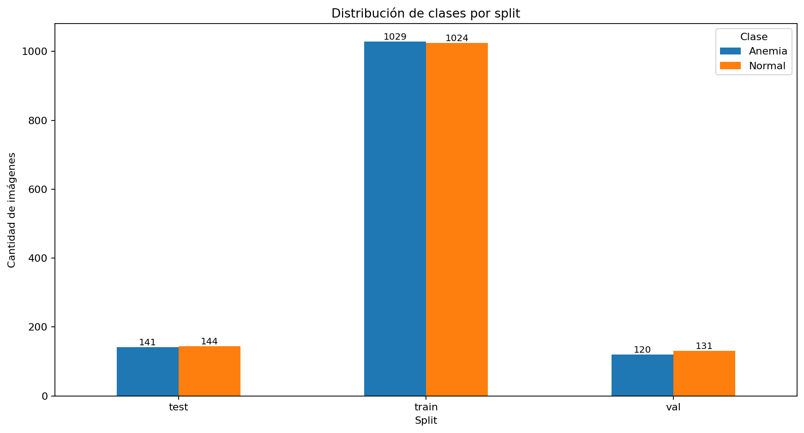
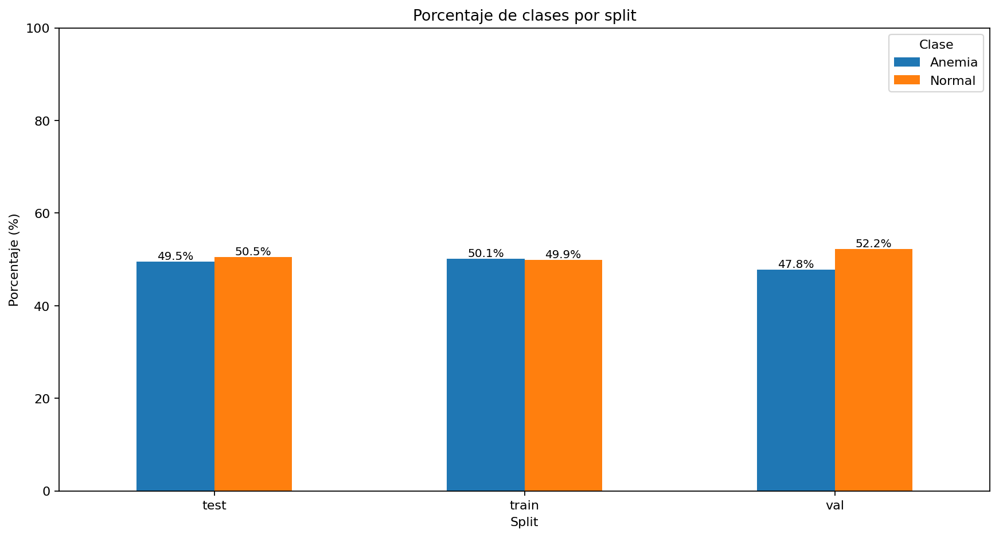
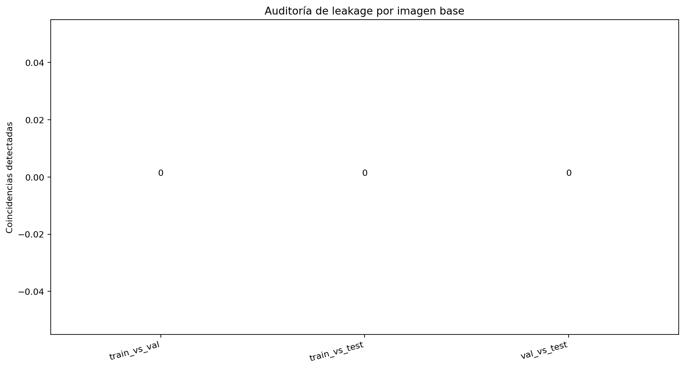
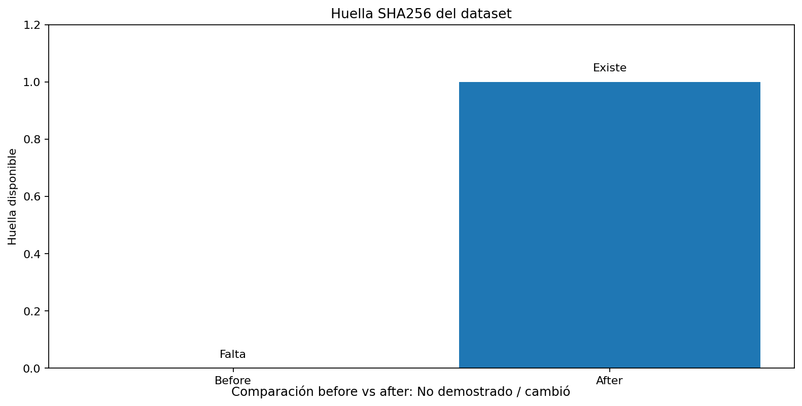
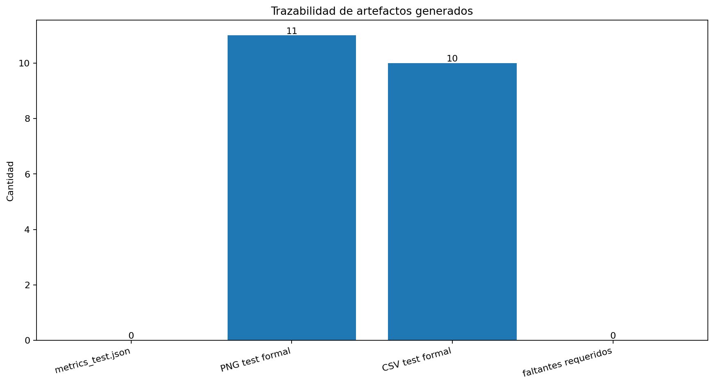
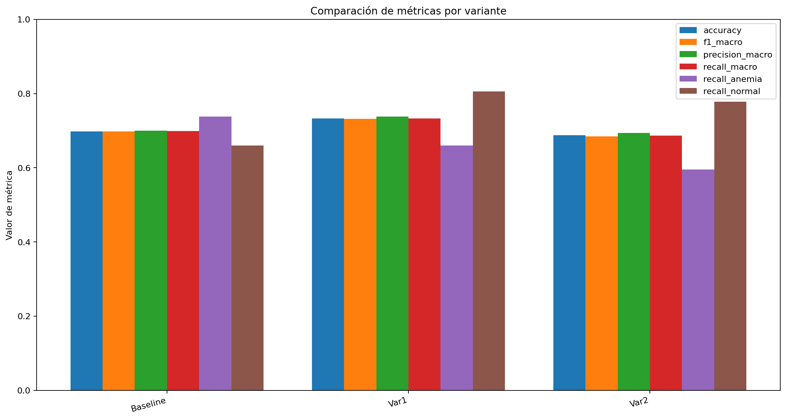
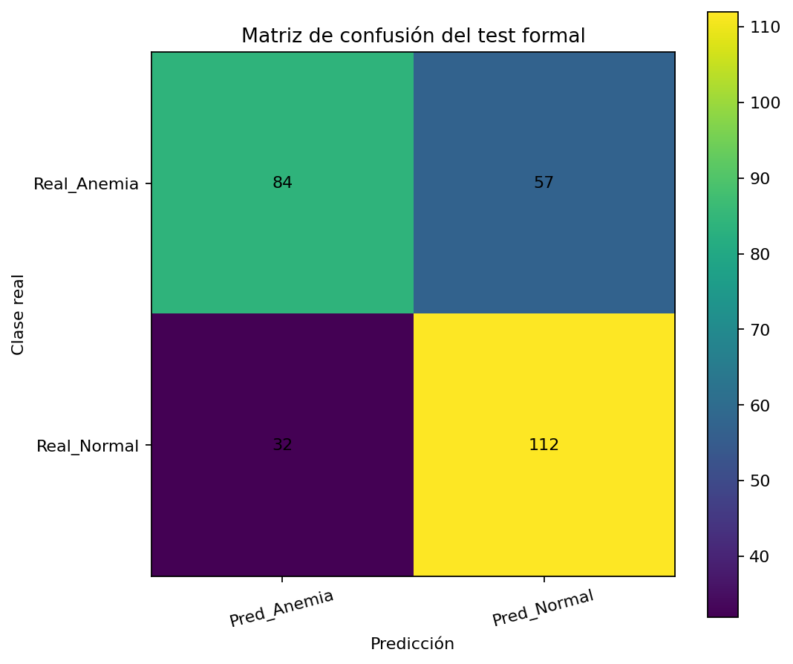
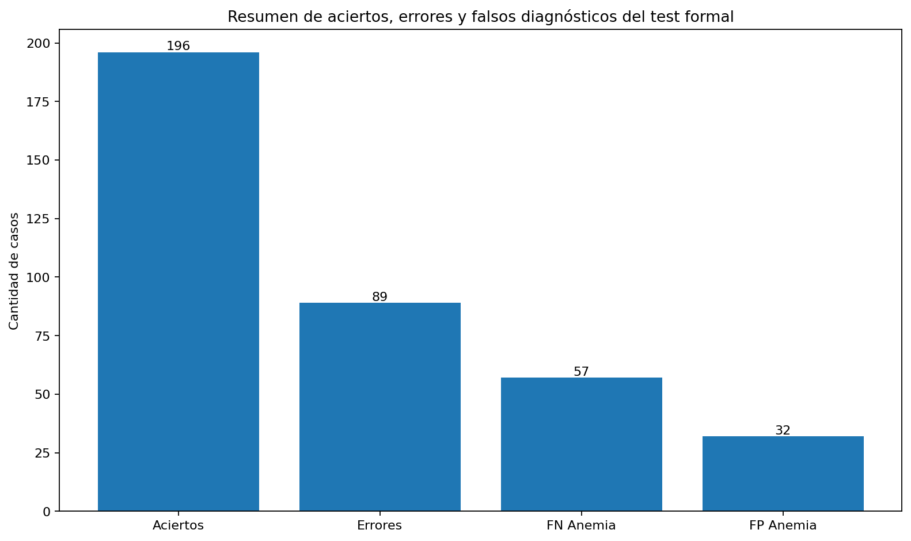

## Limitación metodológica obligatoria

No se puede afirmar split grupal por paciente si el dataset no contiene `patient_id`.  
La auditoría actual defiende no-leakage por imagen base, no por paciente.  
Si falta `dataset_fingerprint_before.json`, no se puede demostrar que la data no cambió entre baseline y evaluación final.

## Lectura objetiva

- Si `fallback_mode=True`, este reporte sirve como auditoría de archivos existentes, pero no reemplaza una ejecución completa del pipeline.
- Para validación fuerte, ejecuta primero todas las celdas principales y luego este bloque.
- El bloque espera encontrar métricas, CSV y figuras ya generadas en `artifacts/week5_pipeline/`.
- Las gráficas de esta validación sirven para exponer control metodológico, no para afirmar validación clínica.
